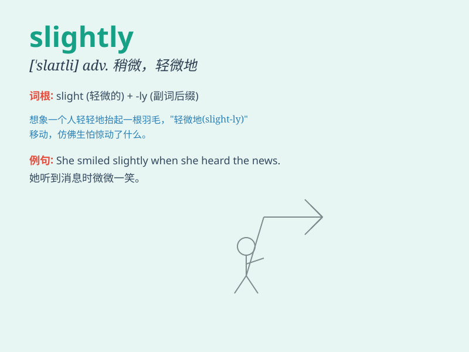

## slightly

**英音:** _[\'slaɪtlɪ]_ **美音:** _[\'slaɪtli]_

**译义:** *adv.些微地,苗条地*

### 短语

+ **slightly different:** _略有不同_

+ **slightly injured:** _受了轻伤_

+ **slightly better:** _稍好一些_

+ **slightly overweight:** _稍微超重_

+ **slightly older:** _稍年长一点_

### 例句

#### 例句1

> **The dress is slightly too big for me.**

**中文翻译:** 这件连衣裙对我来说稍微有点大。

**单词释义:** 稍微；略微

#### 例句2

> **He was slightly injured in the accident.**

**中文翻译:** 他在事故中受了点轻伤。

**单词释义:** 稍微；轻度地

#### 例句3

> **The temperature has dropped slightly.**

**中文翻译:** 温度略有下降。

**单词释义:** 稍微；稍稍

### 背诵小故事

> A little mouse was walking slightly on a narrow path. It moved
carefully, not too fast and not too slow. Just a tiny bit at a time.
This shows what\'slightly\' means - in a small or gentle way.

**一只小老鼠在狭窄的小路上轻轻地走着。它走得很小心，不太快也不太慢。每次就一点点。这就展示了\'slightly\'的意思------以轻微、少量的方式。**

### 图义

