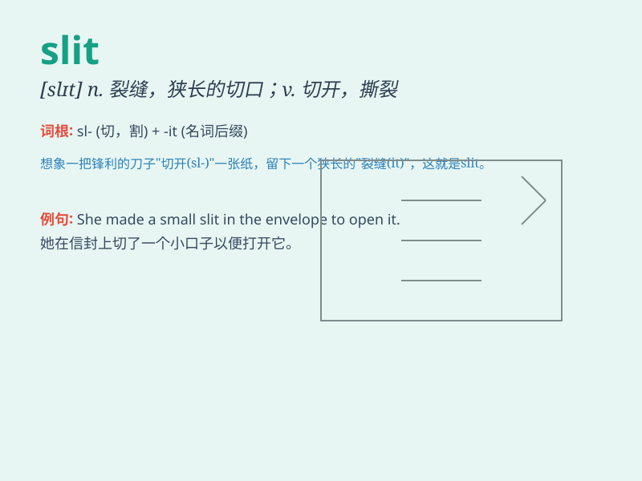

## slit

**英音:** _[slɪt]_ **美音:** _[slɪt]_

**译义:** *vt.切开,撕裂n.裂缝,狭长切口*

### 短语

+ **slit lamp:** _裂隙灯_

+ **slit pocket:** _开缝口袋_

+ **slit width:** _狭缝宽度_

+ **slit throat:** _割喉_

+ **slit film:** _狭缝胶片_

### 例句

#### 例句1

> **She slit the envelope open with a knife.**

**中文翻译:** 她用刀把信封裁开。

**单词释义:** 切开；割开

#### 例句2

> **The thief made a slit in the woman\'s handbag.**

**中文翻译:** 小偷在那个女人的手提包上划了一道口子。

**单词释义:** 划破；划开

#### 例句3

> **The dress has a slit up the side.**

**中文翻译:** 这件连衣裙侧面有个开衩。

**单词释义:** 狭长的切口；裂缝

### 背诵小故事

> A thief wanted to enter a house through a slit in the window. But the
slit was too narrow and he got stuck. Poor thief! Remember, \'slit\'
means a narrow opening or cut.

**一个小偷想通过窗户上的一条狭缝进入房子。但狭缝太窄了，他被卡住了。可怜的小偷！记住，\'slit\'意思是窄缝或切口。**

### 图义

