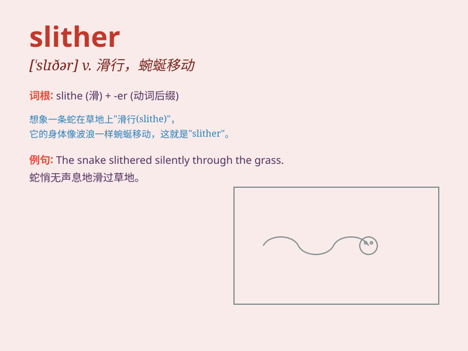

## slither

**英音:** _[\'slɪðə]_ **美音:** _[\'slɪðɚ]_

**译义:** *vi.不稳地滑动vt.使滑动*

### 短语

+ **slither away:** _悄悄溜走；滑行离开_

+ **slither through:** _蜿蜒穿过_

+ **slither along:** _沿着......滑行_

+ **slither down:** _向下滑行_

+ **slither out of:** _从......中滑出_

### 例句

#### 例句1

> **The snake slithered through the grass.**

**中文翻译:** 这条蛇在草丛中蜿蜒爬行。

**单词释义:** 蜿蜒滑行；滑行

#### 例句2

> **The lizard slithered up the wall.**

**中文翻译:** 这只蜥蜴沿着墙滑行上去。

**单词释义:** 滑行；蜿蜒移动

#### 例句3

> **The eel slithered out of the net.**

**中文翻译:** 这条鳗鱼从网里滑出去了。

**单词释义:** 滑动；滑行

### 背诵小故事

> A snake was seen slithering through the grass. It moved smoothly and
silently, like a thief in the night. Its long body seemed to flow
effortlessly as it made its way forward.

**一条蛇被看到在草丛中蜿蜒爬行。它移动得又平滑又安静，就像夜晚的小偷。它长长的身体似乎毫不费力地向前移动。**

### 图义

