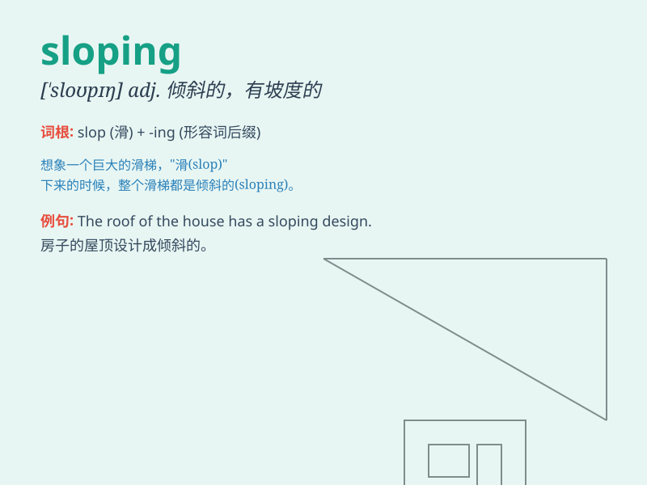

## sloping

**英音:** _[ˈsləʊpɪŋ]_ **美音:** _[ˈsloʊpɪŋ]_

**译义:** *adj.倾斜的,有坡度的*

### 短语

+ **sloping roof:** _倾斜的屋顶_

+ **sloping field:** _倾斜的田地_

+ **sloping beach:** _倾斜的海滩_

+ **sloping driveway:** _倾斜的车道_

+ **sloping garden:** _倾斜的花园_

### 例句

#### 例句1

> **The sloping roof provided good drainage during the rain.**

**中文翻译:** 倾斜的屋顶在下雨时排水良好。

**单词释义:** 倾斜的

#### 例句2

> **We walked up the sloping path to the top of the hill.**

**中文翻译:** 我们沿着倾斜的小路走到山顶。

**单词释义:** 倾斜的

#### 例句3

> **The sloping field was difficult to plow.**

**中文翻译:** 这块倾斜的田地很难犁。

**单词释义:** 倾斜的

### 背诵小故事

> Once upon a time, I was climbing a mountain. The path was sloping
steeply. I had to hold on tight to avoid slipping. Finally, I reached
the top and saw the beautiful view. Remember, \'sloping\' means having a
slope or incline.

**从前，我在爬山。道路倾斜得很厉害。我必须紧紧抓住以防滑倒。最后，我到达了山顶，看到了美丽的景色。记住，'sloping'意思是倾斜的。**

### 图义

