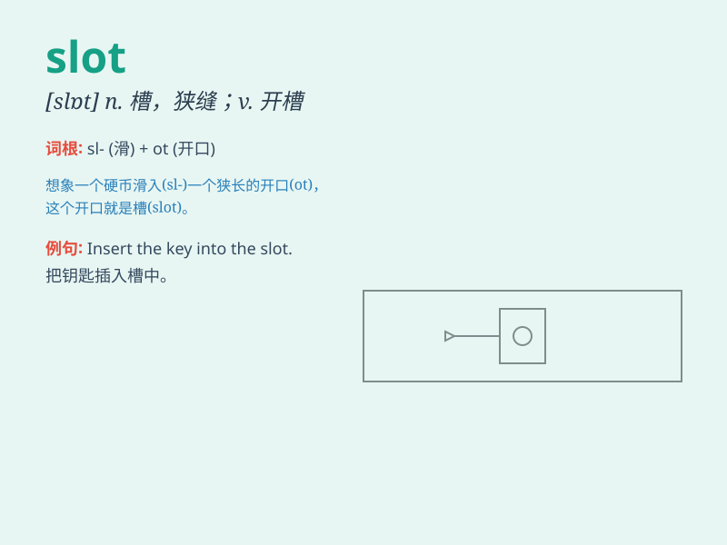

## slot

**英音:** _[slɒt]_ **美音:** _[slɑt]_

**译义:**
*n.缝,狭槽,位置,水沟,细长的孔,硬币投币口,狭通道,足迹vt.开槽于,跟踪*

### 短语

+ **slot machine:** _投币自动售货机；老虎机_

+ **time slot:** _时间段；时隙_

+ **card slot:** _卡槽；卡插槽_

+ **memory slot:** _内存插槽_

+ **coin slot:** _投币口；硬币槽_

### 例句

#### 例句1

> **Insert the coin into the slot.**

**中文翻译:** 把硬币插入狭槽。

**单词释义:** 狭槽；缝隙

#### 例句2

> **I have a slot at 3 o\'clock this afternoon for the meeting.**

**中文翻译:** 我今天下午 3 点有个会议的时间段。

**单词释义:** （时间上的）时段；空位

#### 例句3

> **The machine has several slots for different cards.**

**中文翻译:** 这台机器有几个用于不同卡片的插槽。

**单词释义:** 插槽

### 背诵小故事

> 想象一下，一个神秘的机器有很多
slot（插槽），就像一个宝藏盒子的开口。钥匙必须准确插入对应的 slot
才能打开宝藏。所以 slot 就是指狭缝、槽口。

**想象一个有很多插槽的神秘机器，钥匙要插入对应的插槽才能打开宝藏，以此来记住
slot 是狭缝、槽口的意思。**

### 图义

