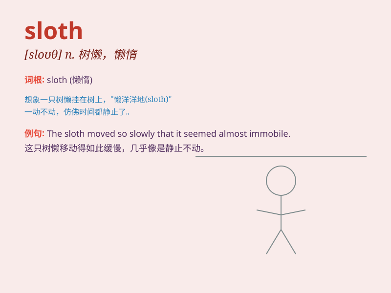

## sloth

**英音:** _[sləʊθ]_ **美音:** _[sloθ]_

**译义:** *n.怠惰,懒惰*

### 短语

+ **tree sloth:** _树懒_

+ **sloth bear:** _印度懒熊_

+ **habitual sloth:** _习惯性的懒惰_

+ **sloth of mind:** _思想上的懒惰_

+ **indolence and sloth:** _懒惰和怠惰_

### 例句

#### 例句1

> **The sloth moves very slowly through the trees.**

**中文翻译:** 树懒在树林中移动得非常缓慢。

**单词释义:** 树懒

#### 例句2

> **His sloth in doing homework led to poor grades.**

**中文翻译:** 他做作业时的懒惰导致成绩很差。

**单词释义:** 懒惰

#### 例句3

> **Sloth is one of the seven deadly sins.**

**中文翻译:** 懒惰是七宗罪之一。

**单词释义:** 懒惰

### 背诵小故事

> Once upon a time, there was a lazy monkey. It spent all day sleeping
and doing nothing. People called it a sloth. It was so slow and
reluctant to move. This is how I remember the word \'sloth\' meaning
laziness.

**从前，有一只懒惰的猴子。它整天睡觉，什么也不做。人们称它为树懒。它行动非常缓慢，也不愿意动。这就是我记住'sloth'这个表示懒惰的单词的方式。**

### 图义

