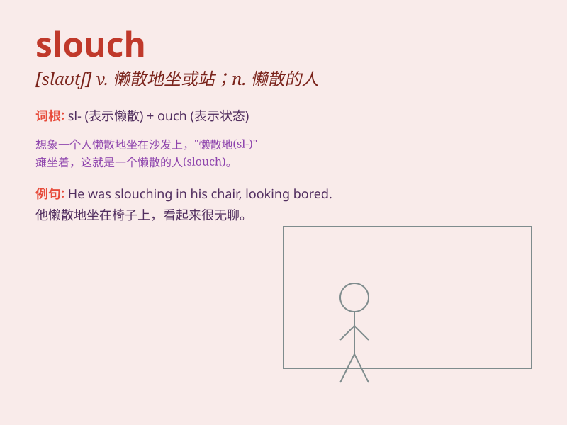

## slouch

**英音:** _[slaʊtʃ]_ **美音:** _[slaʊtʃ]_

**译义:** *v.懒散*

### 短语

+ **slouch around:** _懒散地到处走_

+ **slouch posture:** _懒散的姿势_

+ **slouch hat:** _软帽_

+ **slouch down:** _无精打采地坐下_

+ **slouch in a chair:** _没精打采地坐在椅子上_

### 例句

#### 例句1

> **Don\'t slouch in your chair; sit up straight.**

**中文翻译:** 别在椅子上没精打采的，坐直了。

**单词释义:** 没精打采地坐（或站）

#### 例句2

> **She always slouches when she walks.**

**中文翻译:** 她走路时总是弯腰驼背。

**单词释义:** 弯腰驼背地走

#### 例句3

> **He\'s such a slouch; he never does any work.**

**中文翻译:** 他真是个懒鬼，从不做任何工作。

**单词释义:** 懒散的人；懒鬼

### 背诵小故事

> A slouching man was always criticized for his bad posture. One day,
he decided to stand up straight and change. With effort, he overcame the
habit of slouching and became more confident.

**一个总是弯腰驼背（slouch）的男人总是因为他糟糕的姿势而受到批评。有一天，他决定挺直腰板改变。经过努力，他克服了弯腰驼背的习惯，变得更加自信。**

### 图义

