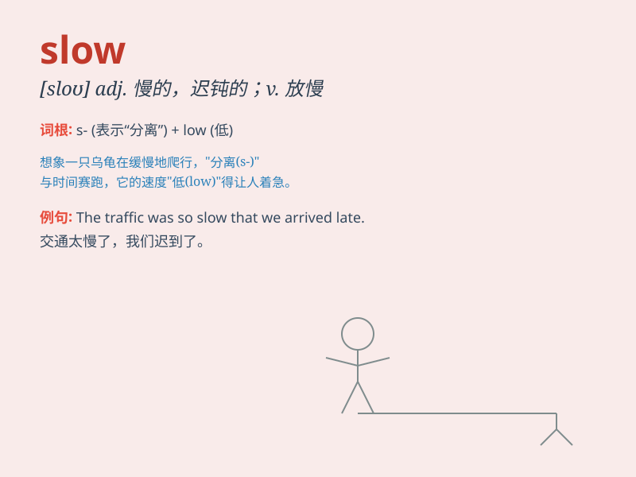

## slow

**英音:** _[sləʊ]_ **美音:** _[sloʊ]_

**译义:** *adj.慢的,迟钝的,不活跃的,缓慢的v.(～
down)(使)慢下来,(使)减速,减缓adv.缓慢*

### 短语

+ **slow down:** _减速；放慢速度_

+ **slow up:** _（使）慢下来；（使）减速_

+ **slow motion:** _慢动作_

+ **slow coach:** _行动迟缓的人；慢性子_

+ **slow burner:** _进展缓慢的事；逐渐引起兴趣的事物_

### 例句

#### 例句1

> **The traffic is very slow during rush hour.**

**中文翻译:** 在高峰时段，交通非常缓慢。

**单词释义:** 缓慢的（形容交通状况）

#### 例句2

> **She is a slow reader.**

**中文翻译:** 她阅读速度很慢。

**单词释义:** 慢的（形容人的阅读速度）

#### 例句3

> **The clock is slow. It\'s five minutes behind.**

**中文翻译:** 这个钟慢了。它慢了五分钟。

**单词释义:** 慢的（形容钟表的运行）

### 背诵小故事

> One day, a little turtle was walking on the road. It moved very
slowly. Other animals passed it quickly. But the turtle didn\'t worry
and kept going at its slow pace. Finally, it reached its destination.

**有一天，一只小乌龟在路上走。它走得非常慢。其他动物很快就超过了它。但乌龟不着急，一直以它缓慢的速度前进。最后，它到达了目的地。**

### 图义

