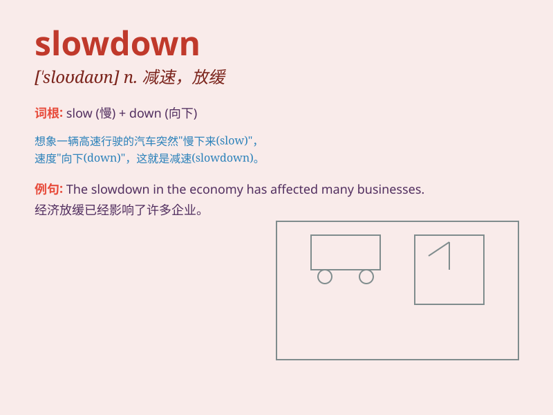

## slowdown

**英音:** _[\'sləʊdəʊn]_ **美音:** _[\'slo\'daʊn]_

**译义:** *n.降低速度,减速*

### 短语

+ **economic slowdown:** _经济放缓_

+ **growth slowdown:** _增长减速_

+ **industrial slowdown:** _工业减速_

+ **market slowdown:** _市场放缓_

+ **production slowdown:** _生产减速_

### 例句

#### 例句1

> **The economic slowdown has led to many job losses.**

**中文翻译:** 经济放缓导致了许多人失业。

**单词释义:** 放缓；减速

#### 例句2

> **There has been a slowdown in the construction industry.**

**中文翻译:** 建筑业出现了减速。

**单词释义:** 减速；减缓

#### 例句3

> **The company is trying to deal with the slowdown in sales.**

**中文翻译:** 公司正试图应对销售的放缓。

**单词释义:** 放缓；下降

### 背诵小故事

> A car was speeding on the highway. Suddenly, the engine had a problem
and there was a slowdown. The driver was very worried. Finally, they
managed to stop safely.

**一辆汽车在高速公路上疾驰。突然，发动机出了问题，速度减慢了。司机非常担心。最后，他们成功安全地停了下来。**

### 图义

