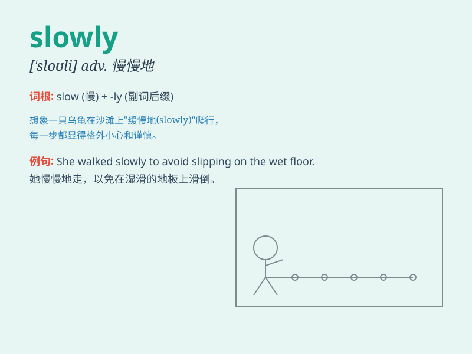

## slowly

**英音:** _[\'sləʊlɪ]_ **美音:** _[\'sloli]_

**译义:** *adv.慢慢地,迟缓地*

### 短语

+ **walk slowly:** _慢慢走_

+ **speak slowly:** _慢慢说_

+ **drive slowly:** _慢慢驾驶_

+ **move slowly:** _慢慢移动_

+ **eat slowly:** _慢慢吃_

### 例句

#### 例句1

> **He walked slowly along the street.**

**中文翻译:** 他沿着街道慢慢地走。

**单词释义:** 慢慢地

#### 例句2

> **The clock ticks slowly.**

**中文翻译:** 这个钟走得很慢。

**单词释义:** 慢慢地

#### 例句3

> **She answered the question slowly to make sure she was
correct.**

**中文翻译:** 她慢慢地回答问题以确保自己是正确的。

**单词释义:** 慢慢地

### 背诵小故事

> One day, a little turtle was walking on the road. It moved very
slowly. A rabbit passed by and laughed at it. But the turtle didn\'t
care and kept going at its own slowly pace. Finally, it reached its
destination.

**一天，一只小乌龟在路上走。它走得非常慢。一只兔子路过并嘲笑它。但乌龟不在乎，仍然以它缓慢的步伐前进。最后，它到达了目的地。**

### 图义

