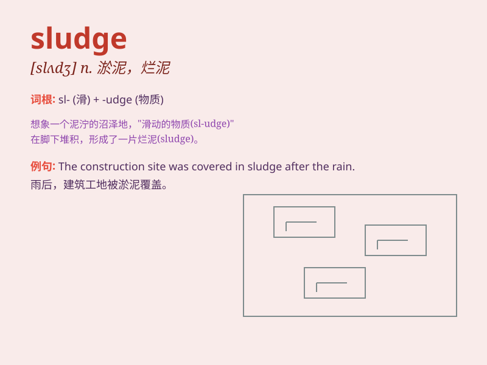

## sludge

**英音:** _[\'slʌdʒ]_ **美音:** _[slʌdʒ]_

**译义:** *n.软泥,淤泥,矿泥,煤泥*

### 短语

+ **sludge treatment:** _污泥处理_

+ **oil sludge:** _油泥_

+ **sewage sludge:** _污水污泥_

+ **sludge disposal:** _污泥处置_

+ **activated sludge:** _活性污泥_

### 例句

#### 例句1

> **The factory was fined for discharging sludge into the river.**

**中文翻译:** 这家工厂因向河里排放淤泥而被罚款。

**单词释义:** 淤泥；烂泥

#### 例句2

> **The car wheels got stuck in the thick sludge.**

**中文翻译:** 汽车轮子陷在厚厚的淤泥里了。

**单词释义:** 淤泥

#### 例句3

> **The oil refinery produces a lot of toxic sludge.**

**中文翻译:** 这家炼油厂产生大量有毒的废渣。

**单词释义:** 废渣；沉淀物

### 背诵小故事

> 想象一下，在一个化工厂里，有一堆又脏又稠的黑色物质，那就是 sludge
。工人们都讨厌处理它，因为它又黏又臭。这种像烂泥一样的东西，就是淤泥、残渣的意思。

**想象在化工厂里有又脏又稠又黏又臭的黑色物质，那就是淤泥、残渣，以此来辅助记忆单词sludge的意思。**

### 图义

