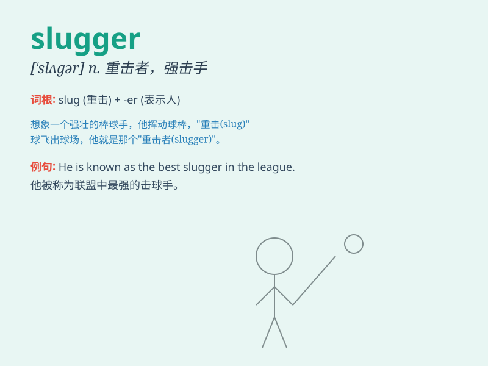

## slugger

**英音:** _[\'slʌɡə]_ **美音:** _[\'slʌɡɚ]_

**译义:** *n.打击力强的选手*

### 短语

+ **power slugger:** _强力击球手_

+ **baseball slugger:** _棒球强击手_

+ **slugger hitter:** _重击击球手_

+ **notable slugger:** _著名的强击手_

+ **prolific slugger:** _多产的击球强手_

### 例句

#### 例句1

> **The baseball team\'s slugger hit a home run in the final
inning.**

**中文翻译:** 这个棒球队的强力击球手在最后一局打出了一个本垒打。

**单词释义:** 强力击球手

#### 例句2

> **He is known as a slugger in the boxing ring.**

**中文翻译:** 他在拳击台上被认为是一个重击手。

**单词释义:** 重击手

#### 例句3

> **The young slugger showed great potential in the tennis
tournament.**

**中文翻译:** 这位年轻的有力击球者在网球锦标赛中展现出了巨大的潜力。

**单词释义:** 有力击球者

### 背诵小故事

>
想象一下，在棒球场上，有一个强壮的选手，每次挥棒都力量十足，能把球打得老远。大家都叫他\'Slugger\'，因为他击球的威力就像炮弹一样强大。他是球队的得分主力，总是能为队伍赢得胜利。

**想象在棒球场上有个强力击球手被称为\'Slugger\'，因其击球威力大，是得分主力能赢比赛。**

### 图义

