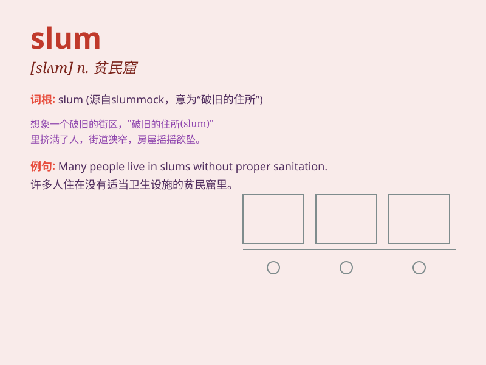

## slum

**英音:** _[slʌm]_ **美音:** _[slʌm]_

**译义:** *n.贫民窟vi.访问贫民区*

### 短语

+ **slum area:** _贫民区_

+ **slum clearance:** _贫民区清理_

+ **slum dweller:** _贫民窟居民_

+ **visit the slum:** _参观贫民窟_

+ **live in a slum:** _住在贫民窟_

### 例句

#### 例句1

> **He grew up in a slum and had a tough childhood.**

**中文翻译:** 他在一个贫民窟长大，度过了艰难的童年。

**单词释义:** 贫民窟

#### 例句2

> **The government is taking measures to improve the living
conditions in the slums.**

**中文翻译:** 政府正在采取措施改善贫民窟的生活条件。

**单词释义:** 贫民窟

#### 例句3

> **She was shocked by the poverty and filth of the slum area.**

**中文翻译:** 她对贫民窟地区的贫困和肮脏感到震惊。

**单词释义:** 贫民窟

### 背诵小故事

> A poor boy named Tom lived in a slum. The slum was dirty and crowded.
But Tom never gave up and finally moved to a better place. Remember,
slum means a poor and crowded area.

**一个叫汤姆的穷孩子住在一个贫民窟。贫民窟又脏又拥挤。但汤姆从未放弃，最终搬到了一个更好的地方。记住，slum
意思是贫民窟。**

### 图义

