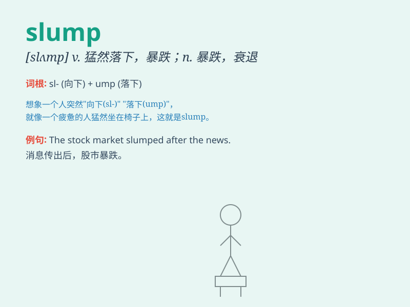

## slump

**英音:** _[slʌmp]_ **美音:** _[slʌmp]_

**译义:** *n.消沉,衰退,(物价)暴跌v.失败,消沉,(物价)暴跌,跌落*

### 短语

+ **economic slump:** _经济衰退_

+ **sales slump:** _销售下滑_

+ **slump in prices:** _价格暴跌_

+ **slump into a chair:** _瘫倒在椅子上_

+ **slump down:** _猛然坐下；倒下_

### 例句

#### 例句1

> **The economy is in a slump.**

**中文翻译:** 经济处于衰退之中。

**单词释义:** 衰退；衰落

#### 例句2

> **She slumped into the chair, exhausted.**

**中文翻译:** 她疲惫不堪，一屁股坐在椅子上。

**单词释义:** 重重地坐下

#### 例句3

> **Sales have slumped this month.**

**中文翻译:** 这个月的销售额大幅下降。

**单词释义:** （数量、价值等）骤降

### 背诵小故事

> A young athlete was doing great, but then suddenly slump. He lost his
form and couldn\'t perform well. It was like he fell into a deep hole.
But with hard work, he came out of the slump and became amazing again.

**一位年轻的运动员原本表现出色，但突然陷入低迷。他状态不佳，表现糟糕，就像掉进了一个深洞。但通过努力，他走出了低谷，再次变得出色。**

### 图义

