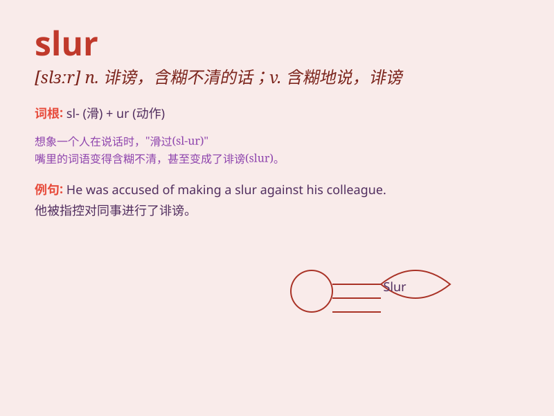

## slur

**英音:** _[slɜː]_ **美音:** _[slɝ]_

**译义:** *v.忽视n.污点*

### 短语

+ **speech slur:** _言语含糊不清_

+ **slur over:** _略过；轻描淡写_

+ **racial slur:** _种族诋毁；种族侮辱_

+ **character slur:** _人格诋毁_

+ **slur one\'s words:** _说话含糊不清_

### 例句

#### 例句1

> **He made a slur against her character.**

**中文翻译:** 他诋毁了她的性格。

**单词释义:** 诋毁；诽谤

#### 例句2

> **The singer\'s words were a slur on the entire community.**

**中文翻译:** 这位歌手的话是对整个社区的污蔑。

**单词释义:** 污蔑；玷污

#### 例句3

> **The speech contained several racial slurs.**

**中文翻译:** 这个演讲包含了几个种族歧视的诋毁言辞。

**单词释义:** 诋毁性的言论；侮辱

### 背诵小故事

> A singer was accused of slurring her words during a performance. The
audience was disappointed. But later, it was found that she had a throat
problem. \'Slur\' means to speak unclearly or indistinctly.

**一位歌手在演出时被指责吐字不清。观众很失望。但后来发现她喉咙有问题。'slur'意思是说话含糊不清。**

### 图义

