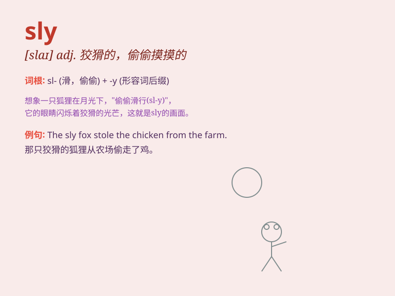

## sly

**英音:** _[slaɪ]_ **美音:** _[slaɪ]_

**译义:** *adj.狡猾的*

### 短语

+ **on the sly:** _偷偷地；秘密地_

+ **sly smile:** _狡黠的微笑_

+ **sly fox:** _狡猾的狐狸_

+ **sly look:** _狡猾的表情_

+ **sly move:** _狡猾的举动_

### 例句

#### 例句1

> **He gave me a sly smile when I caught him cheating.**

**中文翻译:** 当我发现他作弊时，他对我狡黠地笑了笑。

**单词释义:** 狡黠的；诡秘的

#### 例句2

> **She\'s a sly girl who always finds a way to get what she
wants.**

**中文翻译:** 她是个狡猾的女孩，总是能找到办法得到她想要的东西。

**单词释义:** 狡猾的

#### 例句3

> **The fox is known for its sly nature.**

**中文翻译:** 狐狸因其狡猾的天性而闻名。

**单词释义:** 狡猾的；狡诈的

### 背诵小故事

> A sly fox was always looking for ways to steal food from the farm.
One night, it quietly sneaked in and got a big meal. But the farmer was
smart and set up a trap. The fox had to be very careful to avoid being
caught.

**一只狡猾的狐狸总是寻找办法从农场偷食物。一天晚上，它悄悄地潜入并饱餐了一顿。但农夫很聪明，设了一个陷阱。狐狸不得不非常小心以避免被抓住。**

### 图义

