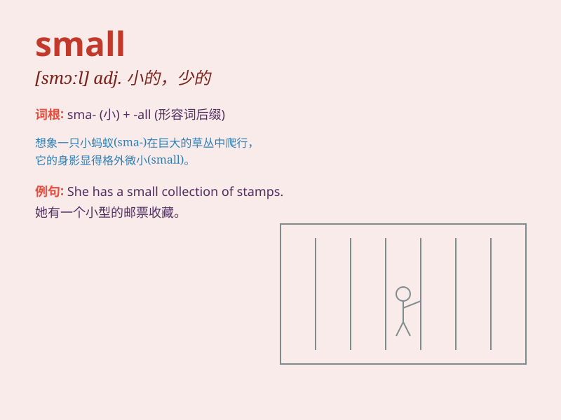

## small

**英音:** _[smɔːl]_ **美音:** _[smɔl]_

**译义:** *adj.小的,少的*

### 短语

+ **small talk:** _闲聊；闲谈_

+ **small business:** _小企业；小生意_

+ **small change:** _零钱；小额硬币_

+ **small world:** _世界真小（用于意外遇到熟人时）_

+ **small wonder:** _不足为奇；并不奇怪_

### 例句

#### 例句1

> **The small dog is very cute.**

**中文翻译:** 这只小狗非常可爱。

**单词释义:** 小的（形容动物）

#### 例句2

> **I have a small room.**

**中文翻译:** 我有一个小房间。

**单词释义:** 小的（形容空间）

#### 例句3

> **She wore a small dress to the party.**

**中文翻译:** 她穿着一件小裙子去参加聚会。

**单词释义:** 小的（形容衣物）

### 背诵小故事

> One day, a little mouse was looking for food. It was very small but
very cute. It could fit into small holes easily. It showed us what
\'small\' means.

**有一天，一只小老鼠在寻找食物。它非常小但是很可爱。它能轻易地钻进小洞里。这向我们展示了'small'（小的）的意思。**

### 图义

