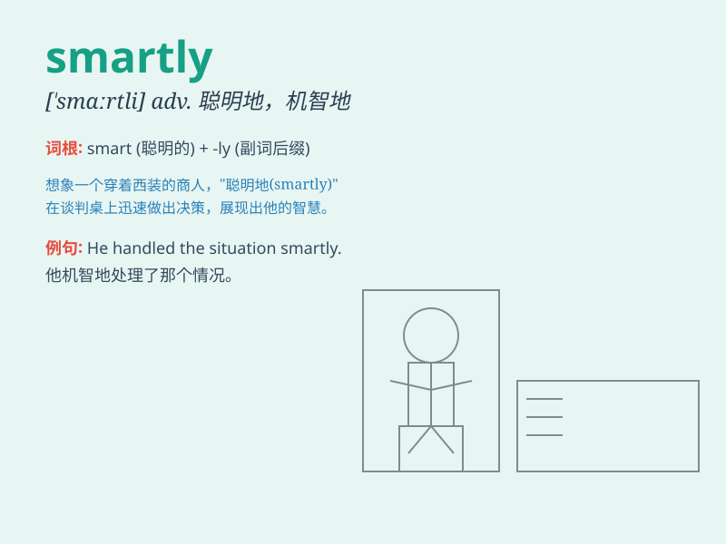

## smartly

**英音:** _[ˈsmɑːtli]_ **美音:** _[ˈsmɑːrtli]_

**译义:** *adv.潇洒地,漂亮地,火辣辣地,刺痛地*

### 短语

+ **dress smartly:** _穿着得体_

+ **behave smartly:** _举止聪明_

+ **answer smartly:** _巧妙回答_

+ **move smartly:** _敏捷移动_

+ **speak smartly:** _说话机智_

### 例句

#### 例句1

> **She dressed smartly for the job interview.**

**中文翻译:** 她为求职面试穿得很得体。

**单词释义:** 得体地

#### 例句2

> **He answered the questions smartly and impressed the panel.**

**中文翻译:** 他巧妙地回答了问题，给评审小组留下了深刻的印象。

**单词释义:** 巧妙地

#### 例句3

> **The soldier moved smartly to the front line.**

**中文翻译:** 这名士兵敏捷地向前线移动。

**单词释义:** 敏捷地

### 背诵小故事

> One day, a little boy was dressed smartly and went to a party.
Everyone praised him for looking so good. He walked and behaved smartly,
making a great impression.

**一天，一个小男孩穿着得体漂亮地去参加派对。每个人都称赞他看起来很好。他走路和举止都很潇洒，给人留下了深刻的印象。**

### 图义

