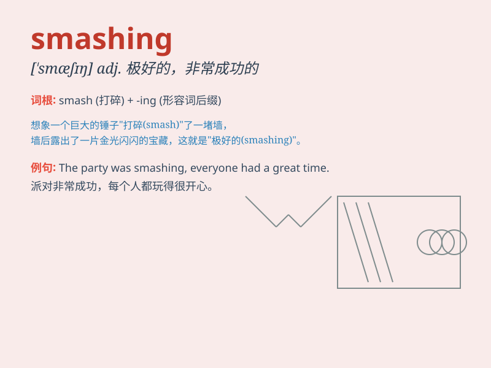

## smashing

**英音:** _[\'smæʃɪŋ]_ **美音:** _[\'smæʃɪŋ]_

**译义:** *adj.粉碎性的,猛烈的,了不起的*

### 短语

+ **smashing success:** _巨大的成功_

+ **smashing party:** _极好的聚会_

+ **smashing performance:** _出色的表演_

+ **smashing time:** _愉快的时光_

+ **smashing hit:** _轰动一时的热门_

### 例句

#### 例句1

> **You look smashing in that dress!**

**中文翻译:** 你穿那件连衣裙看起来美极了！

**单词释义:** 极好的；出色的

#### 例句2

> **We had a smashing time at the party.**

**中文翻译:** 我们在聚会上玩得极开心。

**单词释义:** 极好的；令人愉快的

#### 例句3

> **The team\'s performance was smashing.**

**中文翻译:** 这个团队的表现出色极了。

**单词释义:** 出色的；非凡的

### 背诵小故事

> A thief was trying to break into a house. But the owner caught him
and gave him a smashing punch. The thief was defeated completely.
\'Smashing\' here means very powerful and impressive.

**一个小偷试图闯入一所房子。但主人抓住了他，并给了他一记猛拳。小偷被彻底打败了。'smashing'在这里表示强有力的、令人印象深刻的。**

### 图义

