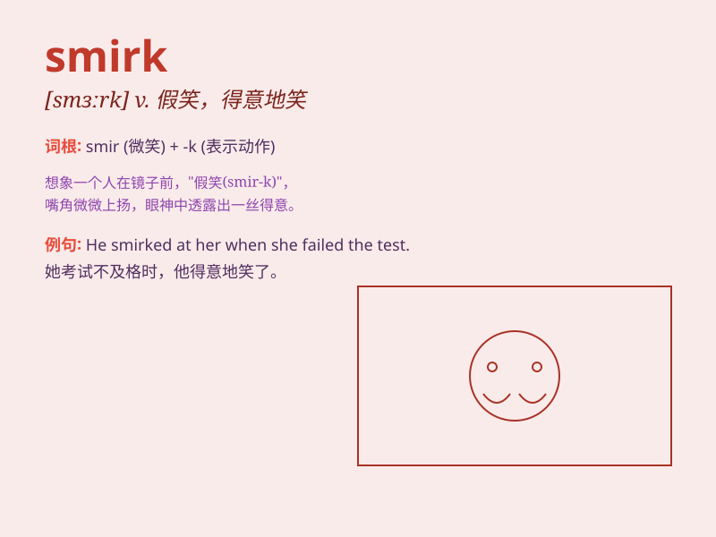

## smirk

**英音:** _[smɜːk]_ **美音:** _[smɝk]_

**译义:** *v.傻笑n.假笑*

### 短语

+ **give a smirk:** _露出一丝假笑_

+ **wry smirk:** _扭曲的假笑_

+ **conceited smirk:** _自负的假笑_

+ **mocking Smirk:** _嘲笑的假笑_

+ **sneaky Smirk:** _鬼鬼祟祟的假笑_

### 例句

#### 例句1

> **He gave a smug smirk when he won the game.**

**中文翻译:** 他赢得比赛时露出了得意的假笑。

**单词释义:** 假笑；得意的笑

#### 例句2

> **She couldn\'t hide the smirk on her face after hearing the
compliment.**

**中文翻译:** 听到赞美后，她脸上藏不住那丝假笑。

**单词释义:** 假笑；暗自得意的笑

#### 例句3

> **The boy had a mischievous smirk as he planned his prank.**

**中文翻译:** 那个男孩在计划恶作剧时露出了调皮的假笑。

**单词释义:** 坏笑；狡黠的笑

### 背诵小故事

> A thief was caught stealing, but instead of showing remorse, he had a
smirk on his face. The smirk was a self-satisfied and somewhat mocking
expression, as if he thought he could get away with it.

**一个小偷在行窃时被抓住了，但他没有表现出懊悔，脸上反而带着一丝假笑。这个假笑是一种自鸣得意且略带嘲弄的表情，好像他认为自己能逃脱惩罚。**

### 图义

