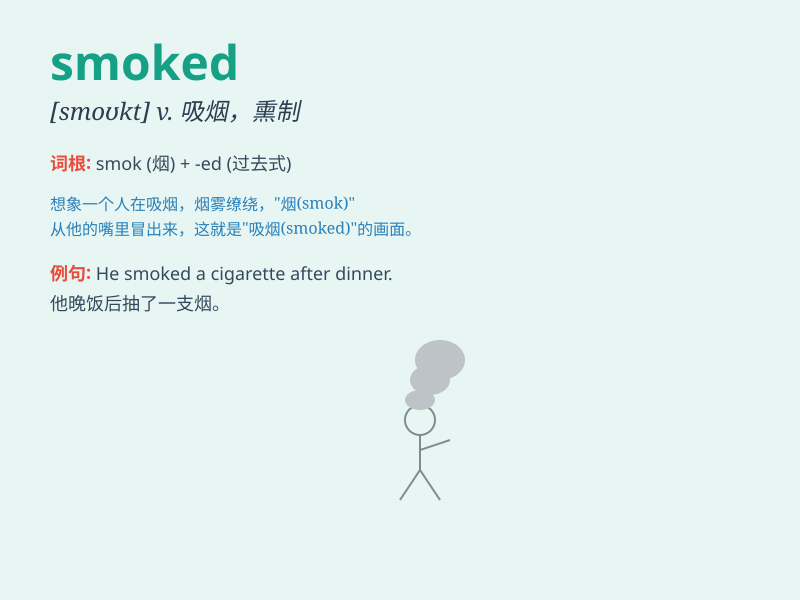

## smoked

**英音:** _[sməʊkt]_ **美音:** _[smōkt]_

**译义:** *v. 吸烟（smoke的过去式和过去分词形式）；用烟熏；n.
烟雾，烟气*

### 短语

+ **smoked salmon:** _熏三文鱼_

+ **smoked meat:** _熏肉_

+ **smoked fish:** _熏鱼_

+ **smoked sausage:** _熏香肠_

+ **smoked cheese:** _熏奶酪_

### 例句

#### 例句1

> **The smoked salmon was delicious.**

**中文翻译:** 这熏制的三文鱼很美味。

**单词释义:** 熏制的

#### 例句2

> **He wore a pair of smoked glasses to protect his eyes from the
sun.**

**中文翻译:** 他戴了一副烟色眼镜以保护眼睛免受阳光伤害。

**单词释义:** 烟色的

#### 例句3

> **The room was filled with the smell of smoked meat.**

**中文翻译:** 房间里充满了熏肉的味道。

**单词释义:** 熏制的

### 背诵小故事

> One day, Tom went to a barbecue party. He saw a lot of food being
smoked. The smell was so attractive. He realized that\'smoked\' means
treated by smoke to give a special flavor.

**有一天，汤姆去了一个烧烤派对。他看到很多食物正在被烟熏。那味道太诱人了。他明白了'smoked'意思是被烟处理以获得特殊风味。**

### 图义

