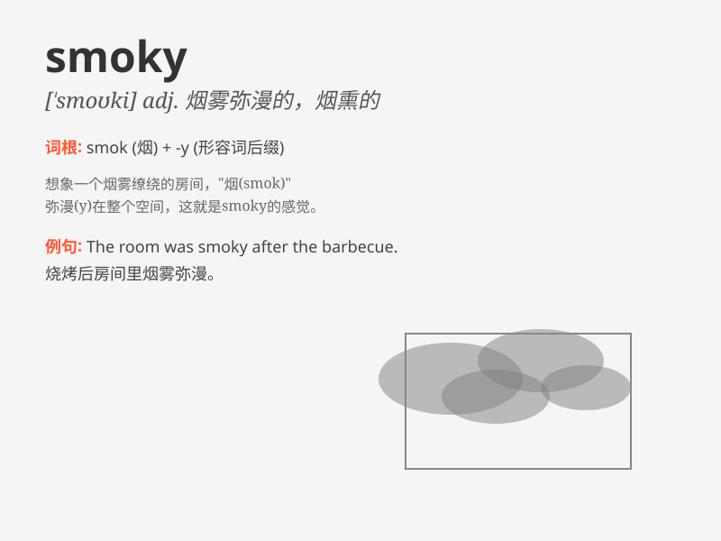

## smoky

**英音:** _[\'sməʊkɪ]_ **美音:** _[\'smoki]_

**译义:** *adj.冒烟的,烟状的,烟熏味的*

### 短语

+ **smoky room:** _烟雾弥漫的房间_

+ **smoky atmosphere:** _烟雾缭绕的氛围_

+ **smoky fire:** _冒烟的火_

+ **smoky chimney:** _冒烟的烟囱_

+ **smoky eyes:** _烟熏妆的眼睛_

### 例句

#### 例句1

> **The room was filled with a smoky haze.**

**中文翻译:** 房间里充满了烟雾弥漫的阴霾。

**单词释义:** 烟雾弥漫的

#### 例句2

> **He emerged from the smoky building, coughing.**

**中文翻译:** 他从烟雾缭绕的大楼里出来，咳嗽着。

**单词释义:** 烟雾缭绕的

#### 例句3

> **The smoky smell of the campfire filled the air.**

**中文翻译:** 篝火的烟熏味弥漫在空气中。

**单词释义:** 烟熏的

### 背诵小故事

> A brave firefighter named Tom was in a building that was smoky. He
couldn\'t see clearly but still bravely searched for people. Remember,
\'smoky\' means full of smoke, just like that building.

**一位勇敢的名叫汤姆的消防员在一栋烟雾弥漫的大楼里。他看不清楚，但仍然勇敢地搜寻着人们。记住，'smoky'意思是充满烟雾的，就像那栋大楼一样。**

### 图义

