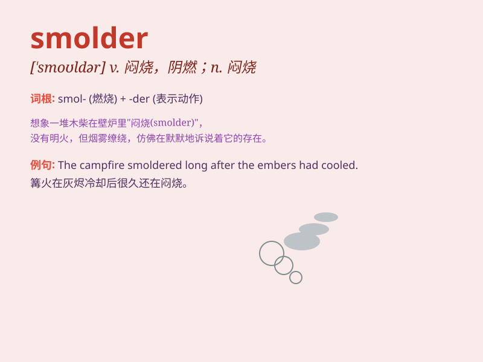

## smolder

**英音:** _[ˈsməʊldə(r)]_ **美音:** _[ˈsmoʊldər]_

**译义:** *vi.郁积,闷烧n.闷烧*

### 短语

+ **smolder away:** _慢慢燃烧；逐渐消失_

+ **smolder with anger:** _心中怒火中烧_

+ **smolder in silence:** _默默地闷烧_

+ **smolder under the surface:** _在表面下暗中燃烧_

+ **emotions smolder within:** _情绪在内心闷燃_

### 例句

#### 例句1

> **The fire smoldered for days after the initial blaze.**

**中文翻译:** 大火过后，火闷烧了好几天。

**单词释义:** 闷烧；阴燃

#### 例句2

> **Her anger smoldered beneath the surface.**

**中文翻译:** 她的怒火在表面之下暗暗燃烧。

**单词释义:** 暗暗燃烧；郁积

#### 例句3

> **The cigarette butt smoldered on the ground.**

**中文翻译:** 那个烟头在地上阴燃着。

**单词释义:** 阴燃

### 背诵小故事

> A fire started in the forest. At first, it just smoldered under the
fallen leaves. The smoke rose slowly, but the heat was building up. It
was a quiet but dangerous start.

**森林里起了火。起初，火只是在落叶下闷烧。烟缓缓升起，但热量在不断积聚。这是一个安静却危险的开端。**

### 图义

