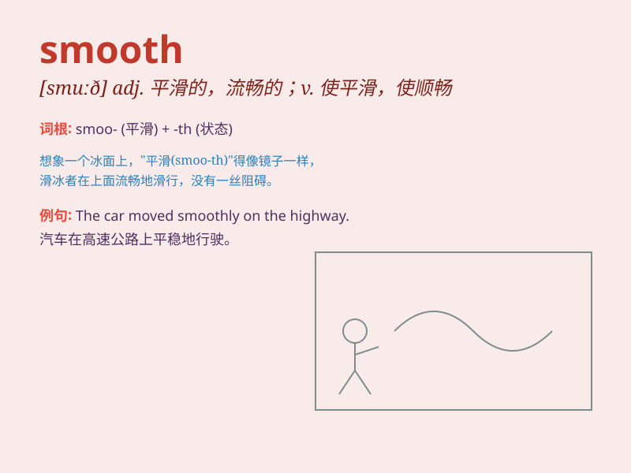

## smooth

**英音:** _[smuːð]_ **美音:** _[smʊð]_

**译义:**
*adj.平滑的,平坦的,平稳的,无毛的,流畅的,圆滑的,安祥的vt.使光滑,烫平,使优雅,消除vi.变平滑,变平静n.一块平地,平滑部分*

### 短语

+ **smooth away:** _消除；解决；克服_

+ **smooth out:** _使平滑；消除（困难等）_

+ **smooth over:** _缓和；调解；平息_

+ **smooth sailing:** _一帆风顺；进展顺利_

+ **smooth talk:** _花言巧语；巧言令色_

### 例句

#### 例句1

> **The road surface is very smooth.**

**中文翻译:** 路面非常平滑。

**单词释义:** 平滑的

#### 例句2

> **She has a smooth way of dealing with difficult customers.**

**中文翻译:** 她有一套对付难缠顾客的巧妙方法。

**单词释义:** 巧妙的；圆滑的

#### 例句3

> **The music flowed smooth and gentle.**

**中文翻译:** 音乐流畅而轻柔。

**单词释义:** 流畅的

### 背诵小故事

> One day, I was skating on a smooth ice rink. There was no bump or
roughness. I skated freely and smoothly. It was such a wonderful
experience!

**一天，我在一个光滑的溜冰场滑冰。那里没有凸起或粗糙的地方。我自由且顺畅地滑着。这是一次美妙的体验！**

### 图义

