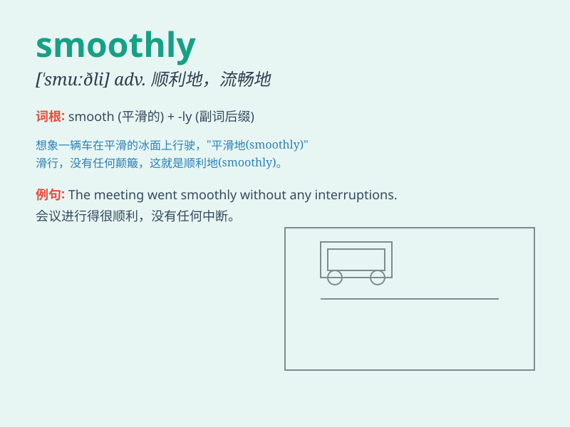

## smoothly

**英音:** _[\'smuːðlɪ]_ **美音:** _[\'smʊðli]_

**译义:** *adv.平稳地*

### 短语

+ **run smoothly:** _平稳运行_

+ **operate smoothly:** _顺利运作_

+ **proceed smoothly:** _进展顺利_

+ **function smoothly:** _正常运转_

+ **go smoothly:** _进行顺利_

### 例句

#### 例句1

> **The project is progressing smoothly.**

**中文翻译:** 这个项目进展顺利。

**单词释义:** 顺利地

#### 例句2

> **The car runs smoothly on the highway.**

**中文翻译:** 汽车在高速公路上行驶平稳。

**单词释义:** 平稳地

#### 例句3

> **The negotiation went smoothly and we reached an agreement.**

**中文翻译:** 谈判进行得很顺利，我们达成了协议。

**单词释义:** 顺利地

### 背诵小故事

> One day, I was riding a bike. The road was smooth and I pedaled
smoothly. There were no bumps or obstacles. It was such a pleasant ride.

**有一天，我在骑自行车。道路很平坦，我骑得很顺畅。没有颠簸或障碍。这是一次非常愉快的骑行。**

### 图义

