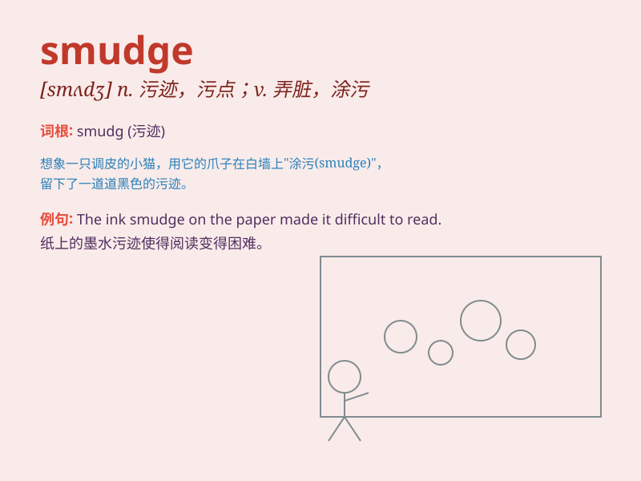

## smudge

**英音:** _[smʌdʒ]_ **美音:** _[smʌdʒ]_

**译义:** *n.污迹,熏烟v.弄脏,用浓烟熏,染污*

### 短语

+ **smudge mark:** _污点；污迹_

+ **smudge proof:** _防污的_

+ **smudge eyeliner:** _晕染的眼线_

+ **smudge effect:** _污迹效果；模糊效果_

+ **smudge removal:** _污迹清除；污渍去除_

### 例句

#### 例句1

> **There was a smudge of dirt on her cheek.**

**中文翻译:** 她的脸颊上有一块污渍。

**单词释义:** 污渍；污点

#### 例句2

> **The ink smudged when I touched the paper.**

**中文翻译:** 我一碰到纸，墨水就弄脏了。

**单词释义:** 弄脏；使模糊

#### 例句3

> **She tried to wipe the smudge off the window.**

**中文翻译:** 她试图擦掉窗户上的污迹。

**单词释义:** 污迹；污点

### 背诵小故事

> One day, Tom was painting. He accidentally got some paint on his hand
and made a smudge. He tried to wipe it off but the smudge remained. It
looked like a funny mark.

**有一天，汤姆在画画。他不小心手上沾了些颜料，弄出了一块污渍。他试图擦掉，但污渍还在。它看起来像一个有趣的记号。**

### 图义

