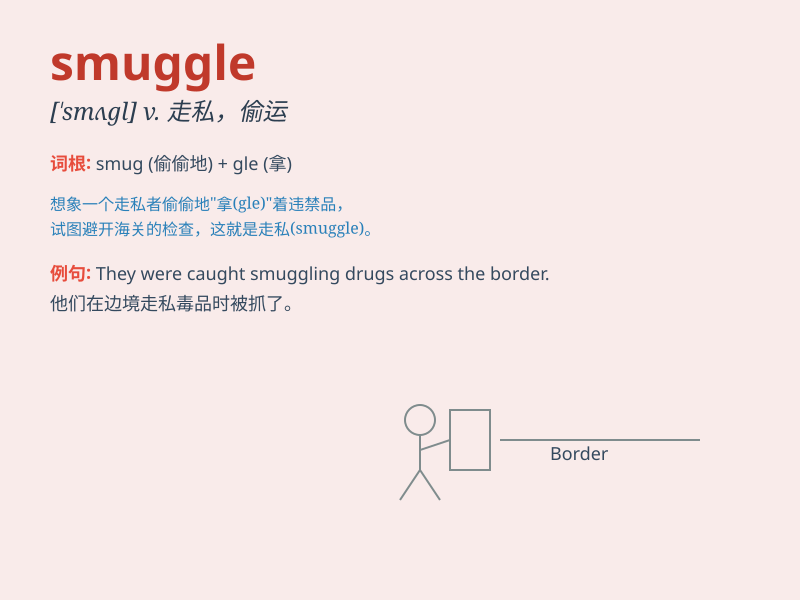

## smuggle

**英音:** _[\'smʌg(ə)l]_ **美音:** _[\'smʌgl]_

**译义:** *n.走私,偷带v.走私*

### 短语

+ **smuggle drugs:** _走私毒品_

+ **smuggle goods:** _走私货物_

+ **smuggle weapons:** _走私武器_

+ **smuggle people:** _偷运人口_

+ **smuggle contraband:** _走私违禁品_

### 例句

#### 例句1

> **He attempted to smuggle drugs into the country.**

**中文翻译:** 他企图把毒品偷运进这个国家。

**单词释义:** 走私；偷运

#### 例句2

> **They were caught smuggling firearms across the border.**

**中文翻译:** 他们在跨境偷运枪支时被抓获。

**单词释义:** 非法携带；偷运

#### 例句3

> **The gang has been smuggling cigarettes for years.**

**中文翻译:** 这个团伙多年来一直在走私香烟。

**单词释义:** 走私；偷运

### 背诵小故事

> A thief wanted to smuggle jewels across the border. He hid them in
his bag, thinking he could avoid being caught. But the customs officers
were smart and found the jewels. Now he faces serious punishment.

**一个小偷想走私珠宝越过边境。他把珠宝藏在包里，以为能逃过被抓。但海关官员很聪明，发现了珠宝。现在他面临着严重的惩罚。**

### 图义

