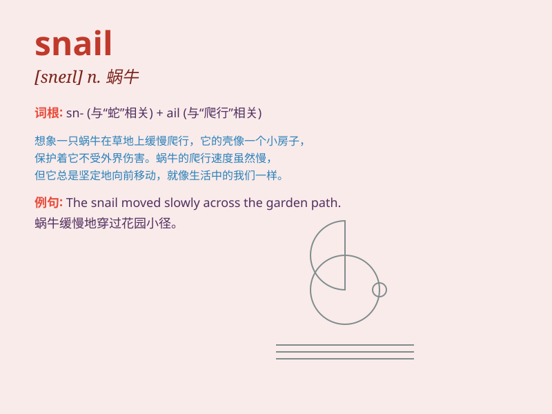

## snail

**英音:** _[sneɪl]_ **美音:** _[snel]_

**译义:** *n.蜗牛,迟钝的人v.捉蜗牛,缓慢移动*

### 短语

+ **snail mail:** _普通邮件（与电子邮件相对）_

+ **garden snail:** _花园蜗牛_

+ **snail pace:** _缓慢的速度_

+ **snail shell:** _蜗牛壳_

+ **land snail:** _陆生蜗牛_

### 例句

#### 例句1

> **The snail moved slowly along the leaf.**

**中文翻译:** 这只蜗牛沿着叶子缓慢移动。

**单词释义:** 蜗牛

#### 例句2

> **She received a letter with a snail on the envelope.**

**中文翻译:** 她收到了一封信，信封上有一只蜗牛。

**单词释义:** 蜗牛

#### 例句3

> **The garden is full of snails after the rain.**

**中文翻译:** 雨后花园里到处都是蜗牛。

**单词释义:** 蜗牛

### 背诵小故事

> A little boy was walking in the garden and saw a snail slowly moving
along a leaf. He watched carefully as the snail left a shiny trail
behind. The snail was so small but persistent in its journey.

**一个小男孩在花园里散步，看到一只蜗牛沿着一片叶子慢慢移动。他仔细观察，蜗牛身后留下了一条闪亮的痕迹。这只蜗牛虽然小，但在它的旅程中坚持不懈。**

### 图义

