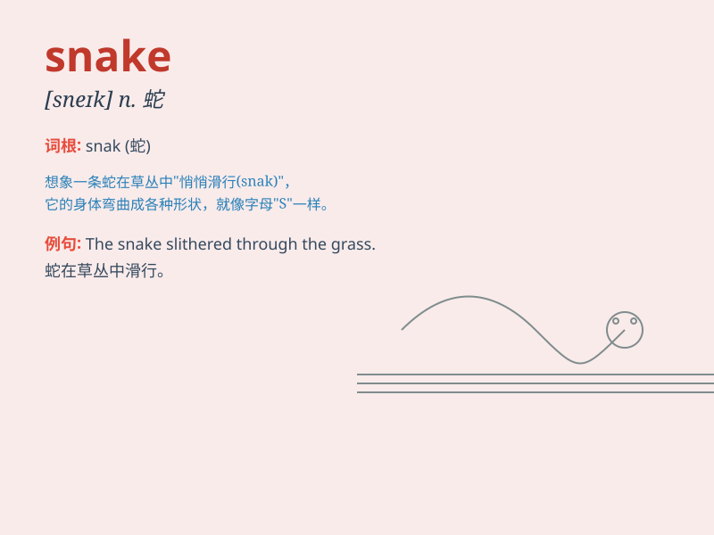

## snake

**英音:** _[sneɪk]_ **美音:** _[snek]_

**译义:** *n.蛇v.迂回前进*

### 短语

+ **snake charmer:** _耍蛇人_

+ **snake bite:** _蛇咬伤_

+ **snake in the grass:** _潜伏的危险；伪装成朋友的敌人_

+ **sea snake:** _海蛇_

+ **poisonous snake:** _毒蛇_

### 例句

#### 例句1

> **The snake slithered through the grass.**

**中文翻译:** 这条蛇在草丛中蜿蜒爬行。

**单词释义:** 蛇

#### 例句2

> **She was frightened when she saw a snake in the garden.**

**中文翻译:** 当她在花园里看到一条蛇时，她被吓到了。

**单词释义:** 蛇

#### 例句3

> **The snake coiled itself around the branch.**

**中文翻译:** 这条蛇把自己盘绕在树枝上。

**单词释义:** 蛇

### 背诵小故事

> A brave boy was walking in the forest. Suddenly, he saw a snake. The
snake was long and slippery. It moved quickly. The boy was scared but
stayed calm and slowly backed away.

**一个勇敢的男孩在森林里走着。突然，他看到了一条蛇。这条蛇又长又滑。它移动得很快。男孩很害怕，但保持冷静，慢慢地往后退。**

### 图义

