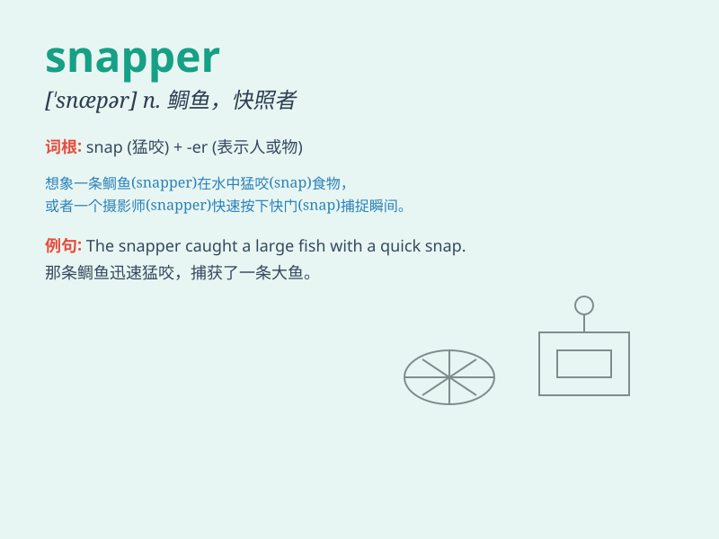

## snapper

**英音:** _[\'snæpə]_ **美音:** _[\'snæpɚ]_

**译义:** *n.咬人的狗,暴燥的人,揿钮,甲鱼*

### 短语

+ **red snapper:** _红鲷鱼_

+ **snapper turtle:** _鳄龟_

+ **job snapper:** _抢工作的人_

+ **photo snapper:** _摄影爱好者；摄影师_

+ **news snapper:** _新闻捕捉者；新闻记者_

### 例句

#### 例句1

> **The snapper was caught by the fisherman.**

**中文翻译:** 这条鲷鱼被渔夫捕获了。

**单词释义:** 鲷鱼

#### 例句2

> **The snapper is a popular fish for cooking.**

**中文翻译:** 鲷鱼是一种受欢迎的烹饪用鱼。

**单词释义:** 鲷鱼

#### 例句3

> **She ordered a plate of fried snapper in the restaurant.**

**中文翻译:** 她在餐厅点了一盘炸鲷鱼。

**单词释义:** 鲷鱼

### 背诵小故事

> A fisherman went fishing and caught a big snapper. It struggled hard
but the fisherman held on tight. The snapper\'s bright colors and sharp
teeth made it stand out. Finally, the fisherman took it home for a
delicious meal.

**一位渔夫去钓鱼，钓到了一条大鲷鱼。它拼命挣扎，但渔夫紧紧抓住。鲷鱼鲜艳的颜色和锋利的牙齿使它格外显眼。最后，渔夫把它带回家美餐了一顿。**

### 图义

