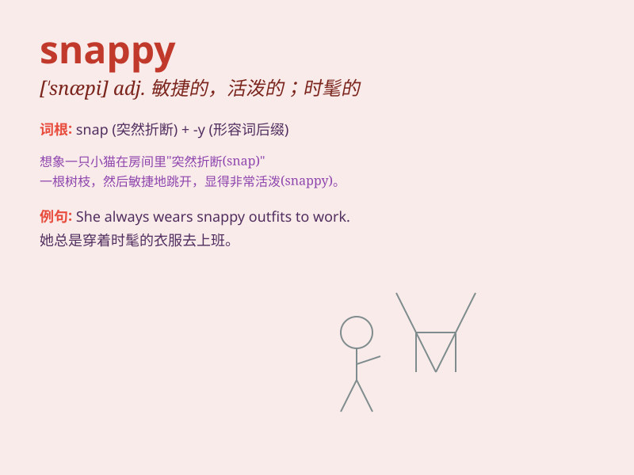

## snappy

**英音:** _[\'snæpɪ]_ **美音:** _[\'snæpi]_

**译义:** *adj.爽快的*

### 短语

+ **snappy dresser:** _穿着时髦的人_

+ **snappy comeback:** _机智的反驳_

+ **snappy pace:** _轻快的步伐_

+ **snappy slogan:** _简洁有力的口号_

+ **snappy conversation:** _活泼有趣的谈话_

### 例句

#### 例句1

> **She was wearing a snappy red dress.**

**中文翻译:** 她穿着一件时髦的红色连衣裙。

**单词释义:** 时髦的；漂亮的

#### 例句2

> **The boss gave a snappy reply to the employee\'s question.**

**中文翻译:** 老板对员工的问题给出了一个干脆利落的回答。

**单词释义:** 干脆利落的；简洁的

#### 例句3

> **The snappy pace of the city life can be overwhelming.**

**中文翻译:** 城市生活的快节奏可能让人难以承受。

**单词释义:** 快速的；活跃的

### 背诵小故事

> A snappy turtle was swimming in the river. It moved quickly and had a
sharp look. One day, it snapped at a fish and caught it easily. Its
actions were so snappy and impressive.

**一只活泼敏捷的乌龟在河里游着。它动作迅速，眼神锐利。有一天，它猛地咬住一条鱼，轻松地抓住了。它的动作是如此迅速和令人印象深刻。**

### 图义

