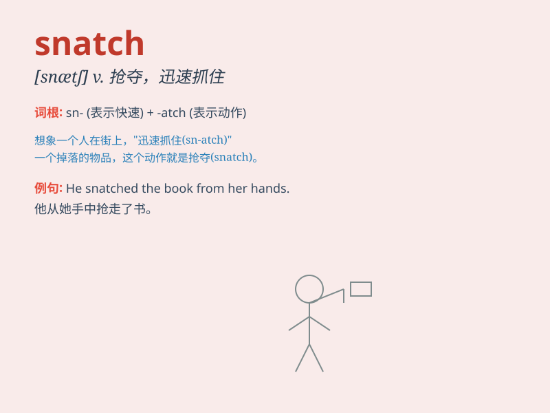

## snatch

**英音:** _[snætʃ]_ **美音:** _[snætʃ]_

**译义:** *v.攫取n.攫取*

### 短语

+ **snatch away:** _抢走；夺走_

+ **snatch at:** _试图抓住；抓取_

+ **snatch up:** _迅速抓起；夺取_

+ **a snatch of sleep:** _片刻的睡眠_

+ **snatch victory from the jaws of defeat:**
_反败为胜；从失败的边缘夺取胜利_

### 例句

#### 例句1

> **He snatched the bag from her hand and ran away.**

**中文翻译:** 他从她手中抢走了包然后跑掉了。

**单词释义:** 抢走

#### 例句2

> **She managed to snatch a few hours of sleep.**

**中文翻译:** 她设法抓紧时间睡了几个小时。

**单词释义:** 抓紧（时间）

#### 例句3

> **The bird snatched the worm in its beak.**

**中文翻译:** 鸟用嘴叼住了虫子。

**单词释义:** 叼住；抓住

### 背诵小故事

> A thief was lurking in the dark. When a lady walked by with her
precious bag, the thief suddenly jumped out and snatched the bag. The
lady was shocked and screamed for help.

**一个小偷潜伏在黑暗中。当一位女士带着她珍贵的包走过时，小偷突然跳出来抢走了包。女士很震惊并大声呼救。**

### 图义

