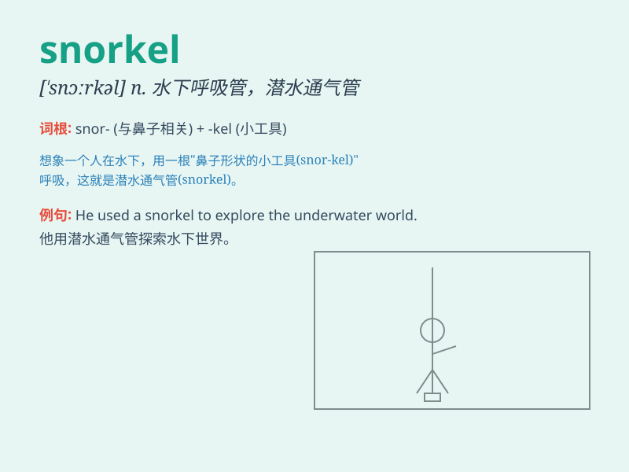

## snorkel

**英音:** _[ˈsnɔːkl]_ **美音:** _[ˈsnɔːrkl]_

**译义:** *n. 通气管, 潜水呼吸管 vi. 使用通气管潜水*

### 短语

+ **snorkel mask:** _潜水面罩_

+ **snorkel gear:** _浮潜装备_

+ **snorkel trip:** _浮潜之旅_

+ **snorkel equipment:** _浮潜设备_

+ **go snorkeling:** _去浮潜_

### 例句

#### 例句1

> **He put on his snorkel and mask before entering the water.**

**中文翻译:** 他在入水前戴上了呼吸管和面罩。

**单词释义:** 呼吸管

#### 例句2

> **The snorkel allows you to breathe while your face is
underwater.**

**中文翻译:** 呼吸管能让你脸在水下时呼吸。

**单词释义:** 呼吸管

#### 例句3

> **She bought a new snorkel for her snorkeling trip.**

**中文翻译:** 她为她的浮潜之旅买了一个新的呼吸管。

**单词释义:** 呼吸管

### 背诵小故事

> A brave diver named Tom forgot his snorkel. But when he saw a
beautiful coral reef, he quickly borrowed a snorkel from a friend. With
the snorkel, he could breathe easily and enjoy the underwater view.

**一位名叫汤姆的勇敢潜水员忘记了他的呼吸管。但当他看到美丽的珊瑚礁时，他迅速从朋友那里借了一个呼吸管。有了呼吸管，他能够轻松呼吸并欣赏水下景色。**

### 图义

