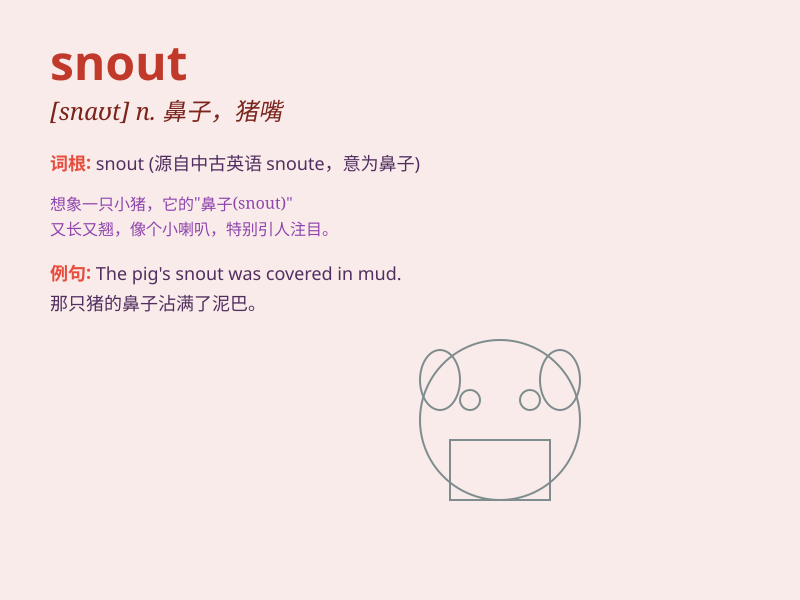

## snout

**英音:** _[snaʊt]_ **美音:** _[snaʊt]_

**译义:** *n.猪嘴*

### 短语

+ **pig snout:** _猪鼻子_

+ **snout of a dog:** _狗的口鼻部_

+ **long snout:** _长鼻子_

+ **snout shape:** _口鼻形状_

+ **sharp snout:** _尖鼻子_

### 例句

#### 例句1

> **The pig pushed its snout into the trough.**

**中文翻译:** 这头猪把它的鼻子伸进了食槽里。

**单词释义:** （猪等动物的）口鼻部

#### 例句2

> **The dog sniffed around with its snout.**

**中文翻译:** 这只狗用鼻子到处嗅。

**单词释义:** 鼻子；口鼻部

#### 例句3

> **The crocodile\'s snout emerged from the water.**

**中文翻译:** 鳄鱼的口鼻部从水里冒了出来。

**单词释义:** 口鼻部

### 背诵小故事

> The little pig had a funny snout. It was always sniffing around for
food. One day, it used its snout to dig up a big carrot. How happy it
was!

**小猪有个有趣的鼻子。它总是用鼻子到处嗅找食物。有一天，它用鼻子挖出了一根大胡萝卜。它多开心啊！**

### 图义

