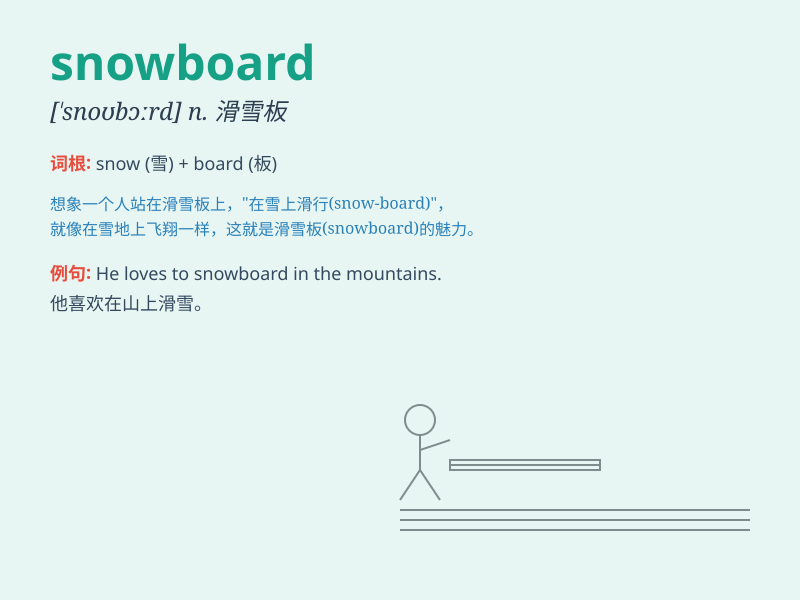

## snowboard

**英音:** _[ˈsnəʊbɔːd]_ **美音:** _[ˈsnoʊbɔːrd]_

**译义:** *n.滑雪板；vi.用滑雪板滑雪*

### 短语

+ **snowboard equipment:** _滑雪板设备_

+ **snowboard park:** _滑雪板公园_

+ **snowboard rental:** _滑雪板租赁_

+ **snowboard competition:** _滑雪板比赛_

+ **snowboard skills:** _滑雪板技巧_

### 例句

#### 例句1

> **I love to snowboard in the mountains during winter.**

**中文翻译:** 我喜欢在冬天去山里滑雪板。

**单词释义:** 滑雪板

#### 例句2

> **He bought a new snowboard for this skiing trip.**

**中文翻译:** 他为这次滑雪之旅买了一个新的滑雪板。

**单词释义:** 滑雪板

#### 例句3

> **She is very skilled at snowboarding and can do various
tricks.**

**中文翻译:** 她滑雪板技术非常娴熟，能做各种花样。

**单词释义:** 滑雪板运动

### 背诵小故事

> One day, a brave boy saw the snow outside. He was eager to have fun
and took his snowboard. He slid down the slope quickly and happily. The
snowboard became his best friend in the snowy world.

**有一天，一个勇敢的男孩看到外面的雪。他渴望玩耍，于是拿起了他的滑雪板。他快速而快乐地沿着斜坡滑下。在这个雪的世界里，滑雪板成了他最好的朋友。**

### 图义

