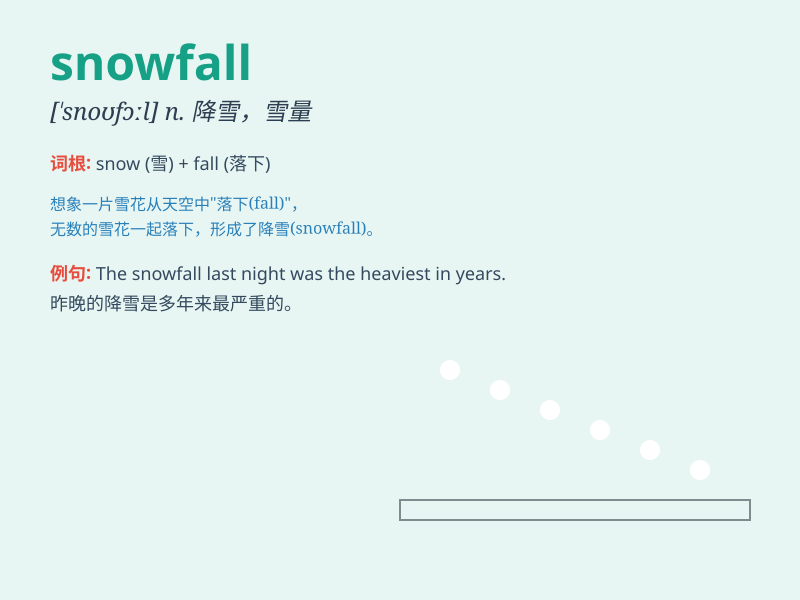

## snowfall

**英音:** _[\'snəʊfɔːl]_ **美音:** _[\'snofɔl]_

**译义:** *n.降雪,降雪量*

### 短语

+ **heavy snowfall:** _大雪_

+ **light snowfall:** _小雪_

+ **abnormal snowfall:** _异常降雪_

+ **seasonal snowfall:** _季节性降雪_

+ **record snowfall:** _创纪录的降雪量_

### 例句

#### 例句1

> **The heavy snowfall made the roads impassable.**

**中文翻译:** 这场大雪使道路无法通行。

**单词释义:** 降雪；降雪量

#### 例句2

> **We haven\'t had such a significant snowfall in years.**

**中文翻译:** 我们已经多年没有这么大的降雪了。

**单词释义:** 降雪

#### 例句3

> **The snowfall was so beautiful that it looked like a
fairyland.**

**中文翻译:** 这场降雪如此美丽，看起来像仙境一般。

**单词释义:** 降雪

### 背诵小故事

> One winter day, I was walking in the forest. Suddenly, a heavy
snowfall started. The white snowflakes were like feathers falling from
the sky. It was a magical and beautiful scene. I was completely amazed
by the snowfall.

**一个冬日，我正在森林里散步。突然，一场大雪降临。洁白的雪花就像羽毛从天空飘落。那是神奇又美丽的景象。我完全被这场降雪惊呆了。**

### 图义

