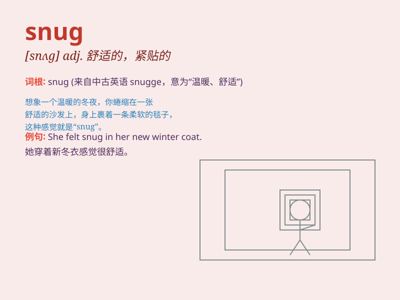

## snug

**英音:** _[snʌg]_ **美音:** _[snʌɡ]_

**译义:** *adj.暖和的*

### 短语

+ **snug fit:** _贴合，紧密配合_

+ **snug as a bug in a rug:** _非常舒适，温暖惬意_

+ **snug harbor:** _安全的港湾_

+ **snug room:** _温暖舒适的房间_

+ **snug jacket:** _舒适的夹克_

### 例句

#### 例句1

> **The cat found a snug corner in the sofa and fell asleep.**

**中文翻译:** 这只猫在沙发上找到了一个舒适的角落然后睡着了。

**单词释义:** 舒适的

#### 例句2

> **She wore a snug sweater to keep warm in the cold weather.**

**中文翻译:** 在寒冷的天气里，她穿了一件贴身保暖的毛衣。

**单词释义:** 贴身的；保暖的

#### 例句3

> **The cottage was snug, despite the strong wind outside.**

**中文翻译:** 尽管外面刮着大风，这个小屋依然很温暖舒适。

**单词释义:** 温暖舒适的

### 背诵小故事

> A little mouse found a snug hole in the wall. It was warm and safe
inside. The mouse felt so comfortable and happy. It thought this snug
place was its perfect home.

**一只小老鼠在墙上发现了一个舒适的洞。洞里面温暖又安全。老鼠感到非常舒适和开心。它觉得这个舒适的地方就是它完美的家。**

### 图义

