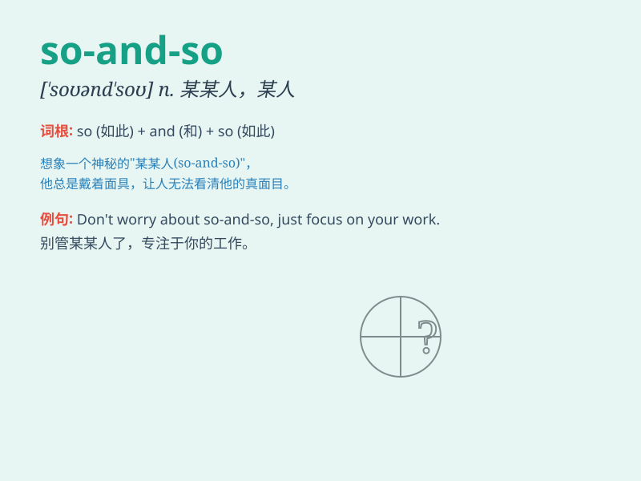

## so-and-so

**英音:** _[ˌsəʊ ən ˈsəʊ]_ **美音:** _[ˌsoʊ ən ˈsoʊ]_

**译义:** *n.某某人；某某东西；讨厌鬼*

### 短语

+ **such and such:** _某某；这样那样的_

+ **so-and-so said:** _某某说_

+ **call someone so-and-so:** _称呼某人为某某_

+ **that so-and-so:** _那个某某_

+ **this so-and-so:** _这个某某_

### 例句

#### 例句1

> **I don\'t like that so-and-so who always talks behind people\'s
backs.**

**中文翻译:** 我不喜欢那个总是在人背后说坏话的某某人。

**单词释义:** 某某人；讨厌的人

#### 例句2

> **She referred to him as so-and-so, but I have no idea who she was
talking about.**

**中文翻译:** 她把他称为某某人，但我不知道她在说谁。

**单词释义:** 某人；不知其名的人

#### 例句3

> **Don\'t be such a so-and-so and help me with this task.**

**中文翻译:** 别这么讨厌，帮我做这项任务。

**单词释义:** 讨厌鬼；令人讨厌的家伙

### 背诵小故事

> One day, a little boy was asked to describe a mysterious person. He
said, \'It was so-and-so. I couldn\'t see clearly.\' This shows that
so-and-so means an unnamed or unknown person.

**一天，一个小男孩被要求描述一个神秘的人。他说：'是某某人。我看不清楚。'这表明
so-and-so 指的是未指名或未知的人。**

### 图义

