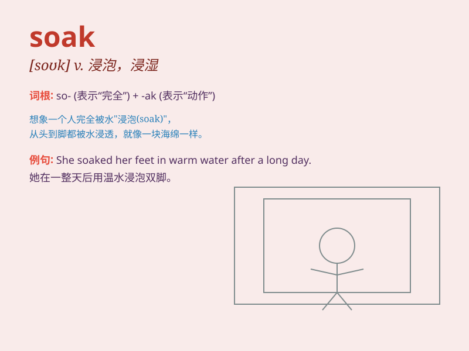

## soak

**英音:** _[səʊk]_ **美音:** _[sok]_

**译义:** *v.浸,泡,浸透n.浸透*

### 短语

+ **soak up:** _吸收；摄取；沉浸于_

+ **soak in:** _被吸收；被理解；被接受_

+ **soak through:** _湿透；渗透_

+ **give sth a soak:** _把某物浸泡一下_

+ **be soaked to the skin:** _浑身湿透_

### 例句

#### 例句1

> **I need to soak these dirty clothes in water for a while.**

**中文翻译:** 我需要把这些脏衣服在水里浸泡一会儿。

**单词释义:** 浸泡

#### 例句2

> **The rain soaked through my coat.**

**中文翻译:** 雨水湿透了我的外套。

**单词释义:** 渗透；湿透

#### 例句3

> **He likes to soak in the bathtub after a long day at work.**

**中文翻译:** 在工作了一整天后，他喜欢泡在浴缸里。

**单词释义:** 泡浴；泡澡

### 背诵小故事

> One day, I accidentally dropped my clothes into a bucket of water.
They had to soak in it for a long time. Later, I realized \'soak\' means
to let something stay in liquid for a while.

**有一天，我不小心把衣服掉进了一桶水里。它们在里面泡了很长时间。后来，我明白了'soak'就是指让某物在液体里停留一段时间。**

### 图义

