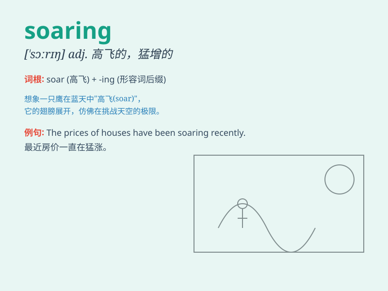

## soaring

**英音:** _[ˈsɔːrɪŋ]_ **美音:** _[ˈsɔːrɪŋ]_

**译义:** *adj.高飞的,翱翔的*

### 短语

+ **soaring prices:** _飞涨的物价_

+ **soaring ambition:** _远大的抱负_

+ **soaring eagle:** _翱翔的鹰_

+ **soaring sales:** _飙升的销售额_

+ **soaring temperature:** _骤升的温度_

### 例句

#### 例句1

> **The price of housing is soaring.**

**中文翻译:** 房价正在飙升。

**单词释义:** 迅速上升；猛增

#### 例句2

> **The eagle was soaring high in the sky.**

**中文翻译:** 那只鹰在天空中高高翱翔。

**单词释义:** 翱翔；高飞

#### 例句3

> **Her hopes were soaring after the good news.**

**中文翻译:** 听到这个好消息后，她的希望高涨。

**单词释义:** 高涨；猛涨

### 背诵小故事

> A little bird was trapped in a cage. One day, it broke free and
started soaring high in the sky. It felt the wind beneath its wings and
experienced the joy of unrestricted flight. Soaring means rising or
flying very high.

**一只小鸟被困在笼子里。有一天，它挣脱了，开始在高空翱翔。它感受到翅膀下的风，体验到了无拘无束飞行的快乐。Soaring
意思是猛增；翱翔；高飞**

### 图义

