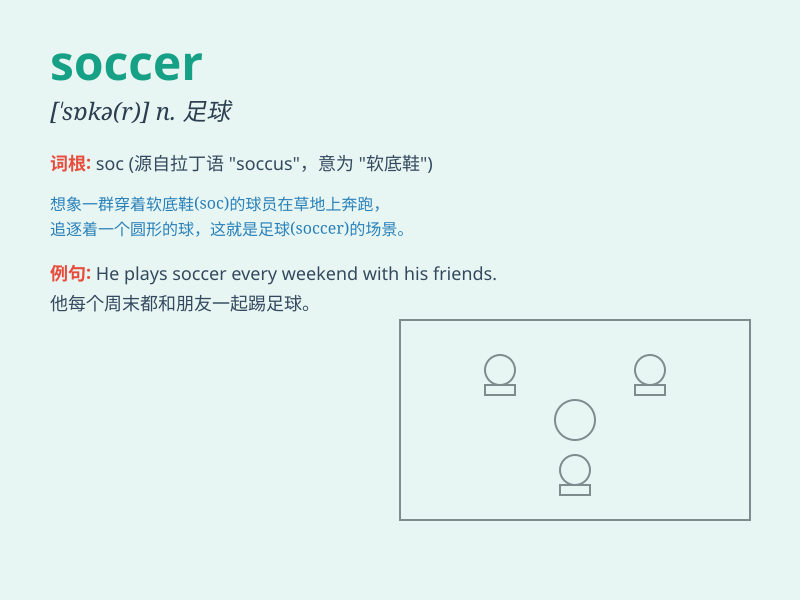

## soccer

**英音:** _[\'sɒkə]_ **美音:** _[\'sɑkɚ]_

**译义:** *n.英式足球*

### 短语

+ **play soccer:** _踢足球_

+ **soccer field:** _足球场_

+ **soccer game:** _足球比赛_

+ **soccer team:** _足球队_

+ **soccer fan:** _足球迷_

### 例句

#### 例句1

> **I love playing soccer with my friends on weekends.**

**中文翻译:** 我喜欢在周末和我的朋友们踢足球。

**单词释义:** 足球（指运动）

#### 例句2

> **The soccer match attracted a large crowd.**

**中文翻译:** 这场足球比赛吸引了大批观众。

**单词释义:** 足球（指比赛）

#### 例句3

> **He is a professional soccer player.**

**中文翻译:** 他是一名职业足球运动员。

**单词释义:** 足球

### 背诵小故事

> One sunny day, Tom and his friends went to the playground. They
decided to play soccer. Tom was very excited. He kicked the ball hard
and scored a goal. Everyone cheered. Playing soccer made them so happy!

**在一个阳光明媚的日子，汤姆和他的朋友们去了操场。他们决定踢足球。汤姆非常兴奋。他用力踢球并进了一球。大家都欢呼起来。踢足球让他们非常开心！**

### 图义

