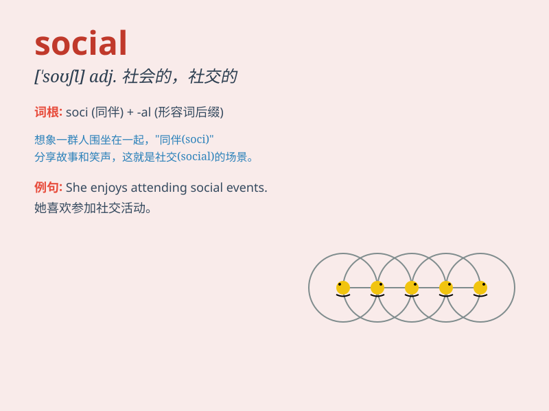

## social

**英音:** _[\'səʊʃ(ə)l]_ **美音:** _[\'soʃl]_

**译义:** *adj.社会的,爱交际的,社交的,群居的*

### 短语

+ **social media:** _社交媒体_

+ **social skills:** _社交技能_

+ **social problem:** _社会问题_

+ **social life:** _社交生活_

+ **social status:** _社会地位_

### 例句

#### 例句1

> **She is very social and has many friends.**

**中文翻译:** 她很善于交际，有很多朋友。

**单词释义:** 善于交际的

#### 例句2

> **The social problems in this city need to be addressed.**

**中文翻译:** 这个城市的社会问题需要得到解决。

**单词释义:** 社会的

#### 例句3

> **He enjoys social activities such as parties and gatherings.**

**中文翻译:** 他喜欢社交活动，比如聚会和集会。

**单词释义:** 社交的

### 背诵小故事

> A young man was very shy and had few friends. But when he joined
social activities, he met many nice people and became confident. Social
means relating to society and the way people interact.

**一个年轻人非常害羞，朋友很少。但当他参加社交活动时，他遇到了很多友好的人，并变得自信起来。Social
意思是与社会和人们互动的方式有关。**

### 图义

