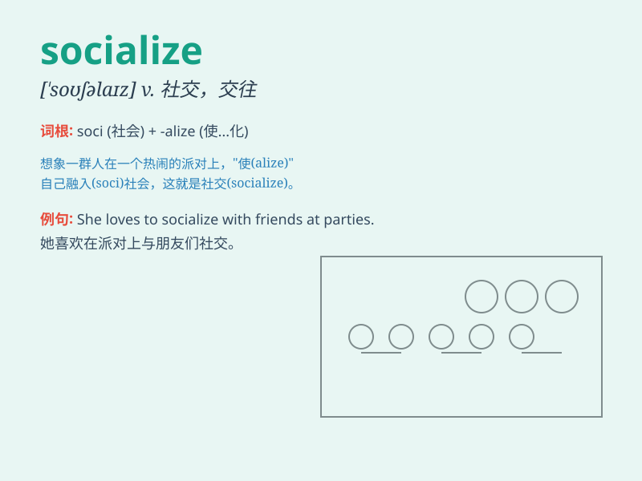

## socialize

**英音:** _[ˈsəʊʃəlaɪz]_ **美音:** _[\'soʃəlaɪz]_

**译义:** *v.使社会化,使社会主义化*

### 短语

+ **socialize with:** _与\...\...交往；与\...\...交际_

+ **socialize easily:** _容易交际_

+ **socialize at parties:** _在聚会上社交_

+ **refuse to socialize:** _拒绝社交_

+ **love to socialize:** _喜欢社交_

### 例句

#### 例句1

> **She doesn\'t like to socialize with strangers.**

**中文翻译:** 她不喜欢和陌生人交往。

**单词释义:** 交往；交际

#### 例句2

> **We often socialize at parties on weekends.**

**中文翻译:** 我们周末经常在聚会上社交。

**单词释义:** 社交

#### 例句3

> **It\'s important for children to socialize with their peers.**

**中文翻译:** 对于孩子来说，和同龄人交往很重要。

**单词释义:** 交往；往来

### 背诵小故事

> One day, Tom was invited to a party. There, he had to socialize with
many strangers. He was nervous at first but soon found it fun to talk
and share. Socializing made him have a great time.

**有一天，汤姆被邀请去参加一个聚会。在那里，他不得不和许多陌生人交往。起初他很紧张，但很快就发现交谈和分享很有趣。社交让他度过了愉快的时光。**

### 图义

