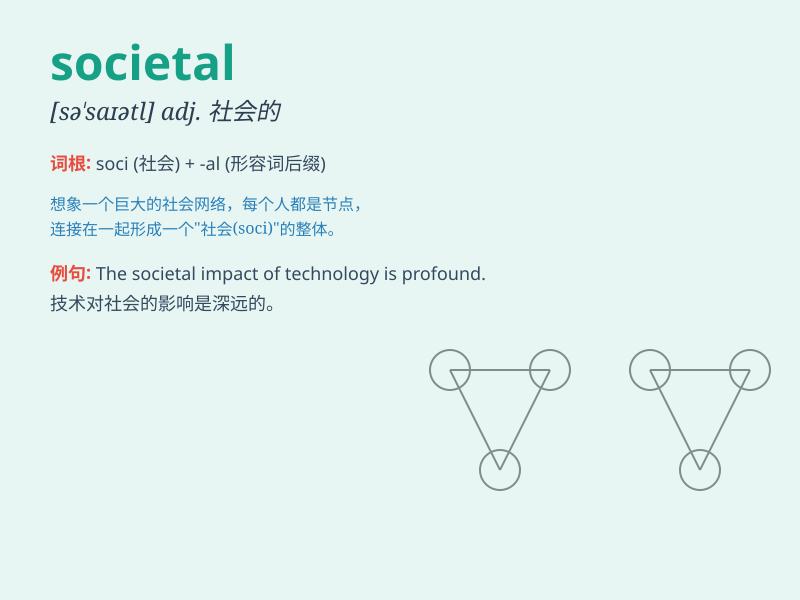

## societal

**英音:** _[sə\'saɪətəl]_ **美音:** _[sə\'saɪətl]_

**译义:** *adj.社会的*

### 短语

+ **societal change:** _社会变革_

+ **societal impact:** _社会影响_

+ **societal norms:** _社会规范_

+ **societal values:** _社会价值观_

+ **societal challenges:** _社会挑战_

### 例句

#### 例句1

> **Societal changes have a profound impact on people\'s lives.**

**中文翻译:** 社会的变化对人们的生活有着深远的影响。

**单词释义:** 社会的

#### 例句2

> **The problem requires a societal solution rather than individual
efforts.**

**中文翻译:** 这个问题需要一个社会层面的解决方案，而非个人的努力。

**单词释义:** 社会的

#### 例句3

> **Societal norms often influence our behavior and choices.**

**中文翻译:** 社会规范常常影响我们的行为和选择。

**单词释义:** 社会的

### 背诵小故事

> In a faraway land, people faced many problems. But they worked
together to solve them for the betterment of societal life. They
understood that societal progress relied on everyone\'s efforts.

**在一个遥远的国度，人们面临许多问题。但他们共同努力去解决，以改善社会生活。他们明白社会的进步依赖于每个人的努力。**

### 图义

