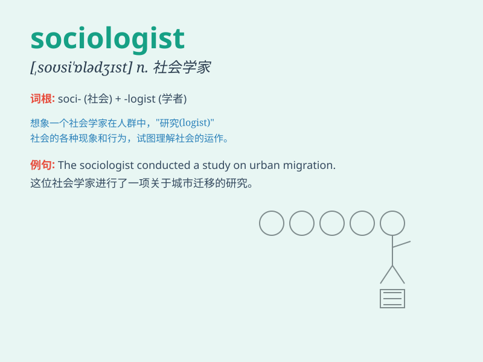

## sociologist

**英音:** _[,səʊsɪ\'ɒlədʒɪst]_ **美音:**
_[,sosɪ\'ɑlədʒɪst]_

**译义:** *n.社会学家,社会学者*

### 短语

+ **medical sociologist:** _医学社会学家_

+ **urban sociologist:** _城市社会学家_

+ **renowned sociologist:** _著名社会学家_

+ **eminent sociologist:** _杰出的社会学家_

+ **prominent sociologist:** _卓越的社会学家_

### 例句

#### 例句1

> **The sociologist conducted extensive research on social
inequality.**

**中文翻译:** 这位社会学家对社会不平等进行了广泛的研究。

**单词释义:** 社会学家

#### 例句2

> **She consulted a sociologist to better understand the community
dynamics.**

**中文翻译:** 她咨询了一位社会学家以更好地理解社区动态。

**单词释义:** 社会学家

#### 例句3

> **The sociologist\'s findings have significant implications for
policy-making.**

**中文翻译:** 这位社会学家的发现对政策制定有重要意义。

**单词释义:** 社会学家

### 背诵小故事

> A sociologist named Tom was always passionate about understanding how
people interact in groups. He spent days observing and analyzing, trying
to solve the mysteries of society. Finally, his research made a big
difference.

**一位名叫汤姆的社会学家总是热衷于了解人们在群体中如何互动。他花了很多天观察和分析，试图解开社会的奥秘。最终，他的研究产生了重大影响。**

### 图义

