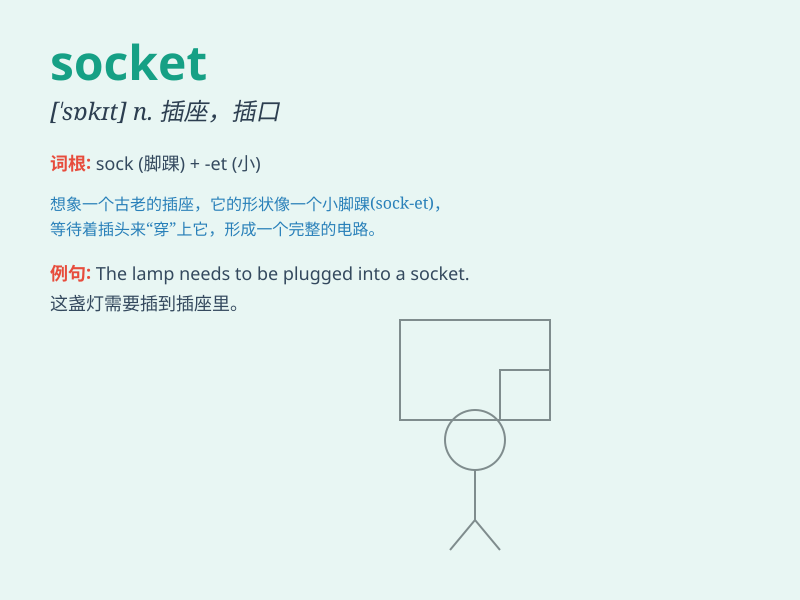

## socket

**英音:** _[\'sɒkɪt]_ **美音:** _[\'sɑkɪt]_

**译义:** *n.窝,穴,孔,插座,牙糟v.给\...配插座*

### 短语

+ **power socket:** _电源插座_

+ **wall socket:** _墙上插座_

+ **socket wrench:** _套筒扳手_

+ **eye socket:** _眼窝_

+ **socket joint:** _承窝接头_

### 例句

#### 例句1

> **He inserted the plug into the socket.**

**中文翻译:** 他把插头插入插座。

**单词释义:** 插座；插孔

#### 例句2

> **The doctor felt the patient\'s socket to check for any
abnormalities.**

**中文翻译:** 医生摸了摸病人的眼窝以检查是否有任何异常。

**单词释义:** 眼窝；牙槽

#### 例句3

> **The baseball hit the socket of his shoulder.**

**中文翻译:** 棒球击中了他的肩关节。

**单词释义:** 关节窝；臼

### 背诵小故事

>
想象一个古老的城堡，夜晚灯火昏暗。骑士寻找着能点亮油灯的地方，终于发现了墙上的一个特殊孔洞------socket，它就像一个神奇的插座，能让油灯稳稳地插进去，带来光明。

**想象一个关于古老城堡中骑士找插座的故事来辅助记忆【socket】这个单词，意思是插座、插孔**

### 图义

