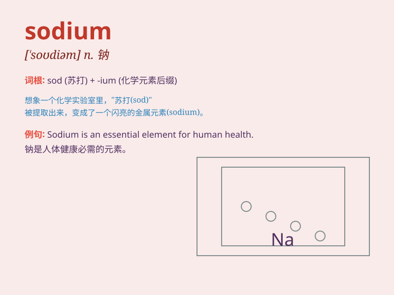

## sodium

**英音:** _[\'səʊdɪəm]_ **美音:** _[\'sodɪəm]_

**译义:** *n.[化] 钠*

### 短语

+ **sodium chloride:** _氯化钠_

+ **sodium bicarbonate:** _碳酸氢钠_

+ **sodium hydroxide:** _氢氧化钠_

+ **sodium nitrate:** _硝酸钠_

+ **sodium sulfate:** _硫酸钠_

### 例句

#### 例句1

> **Sodium is an essential element for our body.**

**中文翻译:** 钠是我们身体的一种必需元素。

**单词释义:** 钠

#### 例句2

> **The compound contains a large amount of sodium.**

**中文翻译:** 这种化合物含有大量的钠。

**单词释义:** 钠

#### 例句3

> **Sodium can be found in many foods we eat daily.**

**中文翻译:** 我们日常吃的许多食物中都能找到钠。

**单词释义:** 钠

### 背诵小故事

> Imagine a scientist in a lab working with a special substance. He
calls it\'sodium\' and explains that it\'s a key element found in salt
and has important roles in our bodies. It\'s like a magic powder that
affects many processes.

**想象一位科学家在实验室里研究一种特殊物质。他称其为"钠"，并解释说它是盐中的关键元素，在我们身体中有着重要作用。它就像一种神奇的粉末，影响着许多过程。**

### 图义

