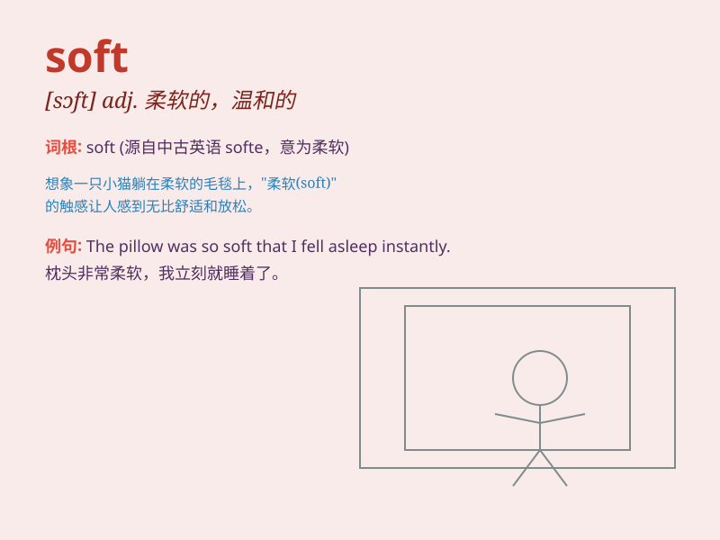

## soft

**英音:** _[sɒft]_ **美音:** _[sɔft]_

**译义:** *adj.软的,柔软的,温和的,温柔的,不含酒精的n.软件*

### 短语

+ **soft drink:** _软饮料；不含酒精的饮料_

+ **soft tissue:** _软组织_

+ **soft skills:** _软技能（指沟通、团队合作等能力）_

+ **soft landing:** _软着陆（指经济或航天器等平稳降落）_

+ **soft heart:** _仁慈的心；善良的心_

### 例句

#### 例句1

> **The sofa is very soft and comfortable.**

**中文翻译:** 这个沙发非常柔软舒适。

**单词释义:** 柔软的

#### 例句2

> **She has a soft voice.**

**中文翻译:** 她有温柔的嗓音。

**单词释义:** 温柔的

#### 例句3

> **The light was soft and flattering.**

**中文翻译:** 光线柔和迷人。

**单词释义:** 柔和的

### 背诵小故事

> One day, I was walking in the park and sat on a soft bench. The
cushion was so soft that it felt like sitting on a cloud. It made me
feel very comfortable and relaxed.

**一天，我在公园散步，坐在一张柔软的长椅上。坐垫非常柔软，感觉就像坐在云朵上。这让我感到非常舒适和放松。**

### 图义

