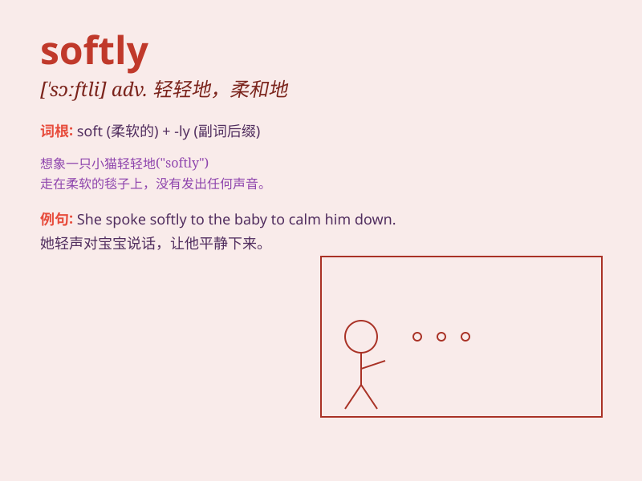

## softly

**英音:** _[ˈsɒftli]_ **美音:** _[ˈsɔːftli]_

**译义:** *adv.柔软地,温柔地*

### 短语

+ **speak softly:** _轻声说话_

+ **walk softly:** _轻轻地走_

+ **whisper softly:** _轻声低语_

+ **breathe softly:** _轻轻地呼吸_

+ **sing softly:** _轻声歌唱_

### 例句

#### 例句1

> **She spoke softly to the frightened child.**

**中文翻译:** 她轻声地对受到惊吓的孩子说话。

**单词释义:** 轻声地

#### 例句2

> **The wind blew softly through the trees.**

**中文翻译:** 风轻柔地吹过树林。

**单词释义:** 轻柔地

#### 例句3

> **He touched her face softly.**

**中文翻译:** 他轻轻地抚摸她的脸。

**单词释义:** 轻轻地

### 背诵小故事

> One night, a little mouse moved softly in the dark. It didn\'t want
to make any noise and wake up the sleeping cat. The mouse walked softly
to find some food.

**一天晚上，一只小老鼠在黑暗中轻轻地移动。它不想发出任何声音吵醒熟睡的猫。老鼠轻轻地走着去寻找一些食物。**

### 图义

