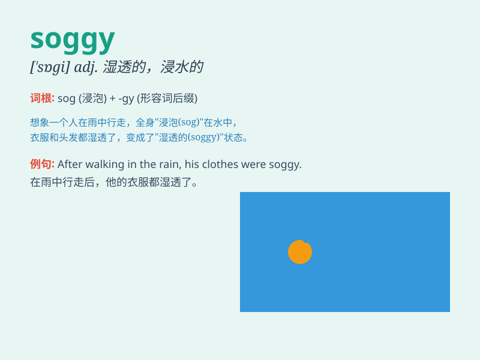

## soggy

**英音:** _[\'sɒgɪ]_ **美音:** _[\'sɑgi]_

**译义:** *adj.浸水的,沉闷的*

### 短语

+ **soggy bread:** _湿透的面包_

+ **soggy weather:** _潮湿的天气_

+ **soggy socks:** _湿透的袜子_

+ **soggy ground:** _湿漉漉的地面_

+ **soggy cereal:** _泡软的麦片_

### 例句

#### 例句1

> **The bread was soggy after being left in the rain.**

**中文翻译:** 面包被留在雨中后变得湿软。

**单词释义:** 湿软的

#### 例句2

> **The ground was soggy from all the recent rainfall.**

**中文翻译:** 由于最近的降雨，地面湿软。

**单词释义:** 湿软的

#### 例句3

> **I don\'t like soggy cereal; it\'s just not appealing.**

**中文翻译:** 我不喜欢湿软的麦片，它没什么吸引力。

**单词释义:** 湿软的

### 背诵小故事

> One rainy day, I went for a walk and stepped on the grass. My shoes
got all soggy. It felt like they were soaking in water. Soggy means
something is very wet and soft, like that grass.

**在一个下雨天，我去散步并踩到了草地。我的鞋子变得湿漉漉的。感觉就像泡在水里一样。soggy
这个单词指的是某物非常潮湿且发软，就像那片草地。**

### 图义

